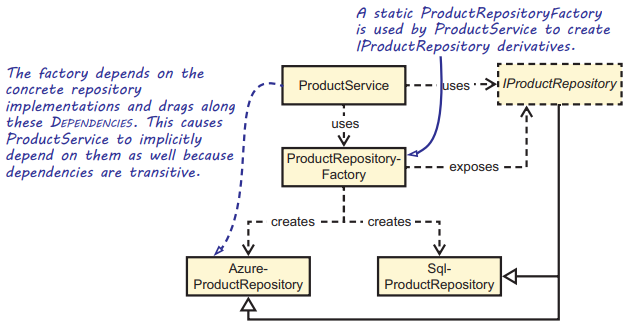
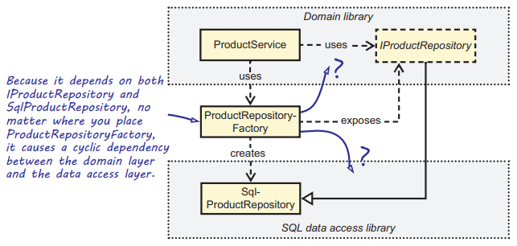
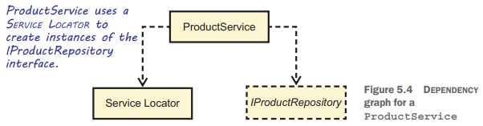
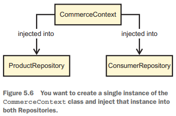
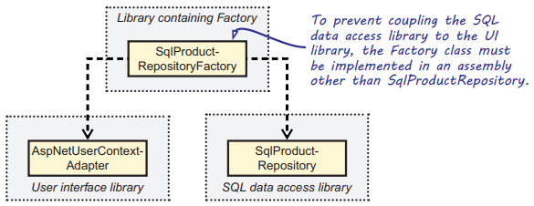

Chapter 5-DI Anti Patterns
==============================

**An *anti-pattern* is a commonly occurring solution to a problem, which generates decidedly negative consequences, although other documented solutions that prove to be more effective are available.**

## Control Freak

The Control Freak anti-pattern occurs every time you depend on a Volatile Dependency in any place other than a Composition Root. For example:
```C#
public class HomeController : Controller {
   public ViewResult Index() {
      var service = new ProductService();   // HomeController creates a new instance of the Volatile Dependency, ProductService, causing tightly coupled code
                                            // hard to unit test since this Volatile Dependency(ProductService) is hardcoded.
      var products = service.GetFeaturedProducts();
      return this.View(products);

   }
}
```
Every time you create a Volatile Dependency, you explicitly state that you're going to control the lifetime of the instance and that no one else will get a chance to Intercept that particular object. In general, the new keyword (you don't need to worry about using it for Stable Dependencies) isn't suddenly "illegal," but you should refrain from using it to get instances of Volatile Dependencies outside the Composition Root.

In chapter 3, you saw how the repository field can be populated via Constructor Injection, but we've seen other control freak like this:
```C#
public class ProductService {
   private readonly IProductRepository repository;

   public ProductService() {
      this.repository = new SqlProductRepository();   // anti-pattern, this directly creates a new instance in the constructor, causing tightly coupled code.
   }

   public IEnumerable<Product> GetFeaturedProducts() {
     ... // repository.GetFeaturedProducts()
   }
}
```
The repository field is declared as the IProductRepository interface, so any member in the ProductService class (such as GetFeaturedProducts) programs to
an interface. Although this sounds like the right thing to do, not much is gained from doing so because, at runtime, the type will always be a SqlProductRepository. There's no way you can Intercept or change the repository variable unless you change the code and recompile. Additionally, you don't gain much by defining a variable as an Abstraction if you hard-code it to always have a specific concrete type. Directly newing up Dependencies is one example of the Control Freak anti-pattern.

## Control Freak through Factories

The most common and erroneous attempt to fix the evident problems from newing up Volatile Dependencies involves a factory of some sort. When it comes to factories, there are several options. We'll quickly cover each of the following:

<ul>
  <li>Concrete Factory</li>
  <li>Abstract Factory</li>
  <li>Static Factory</li>
</ul> 

So Mary starts to write some code to fix the problem. This is the code that Mary writes:
```C#
public class ProductRepositoryFactory {
   public IProductRepository Create() {
      return new SqlProductRepository();   // <--- control freak anti-pattern again
   }
}

public class ProductService {
   private readonly ProductRepositoryFactory factory;

   public ProductService() {
      this.factory = new ProductRepositoryFactory();   // anti-pattern, this directly creates a new instance in the constructor, causing tightly coupled code.
   }

   public IEnumerable<Product> GetFeaturedProducts() {
     ... // factory. Create().GetFeaturedProducts()
   }
}
```
Mary doesn't solve the Control Freak issue but only moves it around.

## Abstract Factory

What if we made the factory abstract, like this:
```C#
public interface IProductRepositoryFactory {
   IProductRepository Create();
}
```
Mary and Jens quickly realize that an Abstract Factory doesn't change their situation. Their original conundrum was that they needed an instance of the abstract IProductRepository, and now they need an instance of the abstract IProductRepositoryFactory instead.

## Static Factory

Let's listen as Mary and Jens decide on an approach that they think will work:
```C#
public static class ProductRepositoryFactory {
   public static IProductRepository Create() {
      return new SqlProductRepository();
   }
}
// Now that the class is static, we don’t need to deal with how to create it
// Jens: But we've still hard-coded that we return SqlProductRepository instances, so does it help us in any way?
// Mary: We could deal with this via a configuration setting that determines which type of ProductRepository to create. Like this:
public static class ProductRepositoryFactory 
{
   public static IProductRepository Create() {
      IConfigurationRoot configuration = new ConfigurationBuilder().SetBasePath(Directory.GetCurrentDirectory()).AddJsonFile("appsettings.json").Build();
      string repositoryType = configuration["productRepository"];
      switch (repositoryType) {
         case "sql": return new SqlProductRepository();
         case "azure": return AzureProductRepository();
         default: throw new InvalidOperationException("...");
      }
   }
}
```
Mary and Jens' static ProductRepositoryFactory reads from the configuration file at runtime, but recall from section 2.3.3 that this is problematic:
Only the finished application should rely on configuration files. Other parts of the application, such as the ProductRepositoryFactory, shouldn't request
values from a configuration file but, instead, should be configurable by their callers.

There are several reasons why such a Static Factory doesn’t provide a satisfactory solution to the original goal of programming to interfaces. Take a look at the Dependency graph:



All classes need to reference the abstract IProductRepository as follows:

<ul>
  <li><b>ProductService</b> because it consumes IProductRepository instances</li>
  <li><b>ProductRepositoryFactory</b> because it creates IProductRepository instances</li>
  <li><b>AzureProductRepository</b> and <b>SqlProductRepository</b> because they implement IProductRepository</li>
  <li><b></b></li>
</ul> 

`ProductRepositoryFactory` depends on both the `AzureProductRepository` and `SqlProductRepository` classes. Because `ProductService` directly depends on `ProductRepositoryFactory`, it also depends on both concrete IProductRepository implementations `AzureProductRepository` and `SqlProductRepository` because dependencies are transitive.

As long as ProductService has a dependency on the static ProductRepositoryFactory, you have unsolvable design issues. If you define the static ProductRepositoryFactory in the domain layer, it means that the domain layer needs to depend on the data access layer, because ProductRepositoryFactory creates a SqlProductRepository that's located in that layer. The data access layer, however, already depends on the domain layer because SqlProductRepository uses types and Abstractions like Product and IProductRepository from that layer. This causes a circular reference between the two projects. Additionally, if you move ProductRepositoryFactory into the data access layer, you still need a dependency from the domain layer to the data access layer
because ProductService depends on ProductRepositoryFactory. This still causes a circular dependency. Figure below shows this design issue:



Instead of loosely coupled IProductRepository implementations, Mary and Jens end up with tightly coupled modules. Even worse, the factory always drags along all implementations—even those that aren't needed! If they host on Azure, they still need to distribute Commerce.SqlDataAccess.dll (that defines SqlProductRepository) with their application.

In short, a Static Factory may seem to solve the problem but, in reality, only compounds it. 

## Control Freak through Overloaded Constructors

The following listing shows the ProductService class with a default and an overloaded constructor. It's an example of what not to do:
```C#
public class ProductService {
   private readonly IProductRepository repository;

   public ProductService() : this(new SqlProductRepository()) { }   // Parameterless constructor forwards the SqlProductRepository Foreign Default 
                                                                    // to the overloaded constructor, making the domain layer couples to SQLdata access layer

   public ProductService(IProductRepository repository) {
      if (repository == null)
         throw new ArgumentNullException("repository");
      
      this.repository = repository;
   }

   public IEnumerable<Product> GetFeaturedProducts() {
     ... // repository.GetFeaturedProducts()
   }
}
```
At first sight, this coding style might seem like the best of both worlds. It allows fake Dependencies to be supplied for the sake of unit testing; whereas, the class can still be conveniently created without having to supply its Dependencies. But ProductService class now depends directly on the SqlProductRepository class.

A service such as a ProductService requires an instance of an IProductRepository to work. In many cases, when you develop such applications, you have a reasonable implementation in mind: one that implements the desired functionality by reading and
writing data to and from a relational database. It would be tempting to use such an implementation as the default. The problem is that the default implementation you have in mind (SqlProductRepository) is defined in a different module. This forces you to take an undesirable dependency on the data access layer.

Dragging along unwanted modules robs you of many of the benefits of loose coupling, which were discussed in chapter 1. It becomes harder to reuse the domain
layer module because it drags along the data access module, although you may want to use that in a different context. It also makes parallel development more difficult because the ProductService class now depends directly on the SqlProductRepository class. (Have to reference extra dll etc).

## Refactoring away from Control Freak using Constructor Injection

Control Freak is the most common DI anti-pattern, you need to refactor your code toward one of the proper DI design patterns. In most cases, this will be Constructor Injection:
```C#
public class ProductService {
   private readonly IProductRepository repository;

   public ProductService(IProductRepository repository) {
      if (repository == null)
         throw new ArgumentNullException("repository");
      
      this.repository = repository;
   }
}
```

## Service Locator

It can be difficult to give up on the idea of directly coutrolling Dependencies, so many developers take Static Factories to new levels. This leads to the Service Locator anti-pattern.

A Service Location suppplies application components outside the Composition Root with access to an unbounded set of Volatile Dependencies. 

The following listing shows the Service Locator anti-pattern in action:
```C#
public class HomeController : Controller {
   public HomeController() { }   // HomeController has a parameterless constructor, hide the dependency of IProductService

   public ViewResult Index() {
      IProductService service = Locator.GetService<IProductService>();   // HomeController requests an IProductService instance from the static Locator class

      var products = service.GetFeaturedProducts();
      return this.View(products);
   }
}
```
HomeController has a parameterless constructor, requesting its Dependencies later. This hides these Dependencies from HomeController’s consumers and makes HomeController harder to use and test.

It's important to note that if you look at only the static structure of classes, a DI Container looks like a Service Locator. The difference is subtle and lies not in the mechanics of implementation, but in how you use it. In essence, asking a container or locator to resolve a complete object graph from the Composition Root is proper usage. Asking it for granular services from anywhere else but the Composition Root implies the Service Locator anti-pattern. Let’s review an example that shows Service Locator in action:
```C#
public class ProductService : IProductService {
   private readonly IProductRepository repository;

   public ProductService() {
      this.repository = Locator.GetService<IProductRepository>();
   }

   public IEnumerable<DiscountedProduct> GetFeaturedProducts() { ... }
}

// The code could also include a feature that enables it to load its configuration from a file
public static class Locator {
   private static Dictionary<Type, object> services = new Dictionary<Type, object>();

   public static void Register<T>(T service) {
      services[typeof(T)] = service;
   }

   public static T GetService<T>() {
      return (T)services[typeof(T)];
   }

   public static void Reset() {
      services.Clear();
   }
}
```
Classes like ProductService rely on the service to be available in the Service Locator, so it's important that it’s previously configured. In a unit test, this could be done with a Test Double implemented by a Stub, as can be seen in the following listing:
```C#
[Fact]
public void GetFeaturedProductsWillReturnInstance() {
   // Arrange
   var stub = ProductRepositoryStub();   // Creates a Stub for the IProductRepository interface

   Locator.Reset();   // Resets the Locator to its default settings to prevent previous tests from influencing this test

   Locator.Register<IProductRepository>(stub);   // Uses the static Register method to configure the Service Locator with the Stub instance

   var sut = new ProductService();

   // Act
   var result = sut.GetFeaturedProducts(); // The internal use of Locator.GetService causes Temporal Coupling 
                                           //between Locator.Register and GetFeaturedProducts
   // Assert
   Assert.NotNull(result);
}
```
The main problem with Service Locator is that it impacts the reusability of the classes consuming it. This manifests itself in two ways:

<ul>
  <li>The class drags along the Service Locator as a redundant Dependency</li>
  <li>The class makes it non-obvious what its Dependencies are</li>
</ul> 

Let's first look at the Dependency graph for the ProductService:



In addition to the expected reference to IProductRepository, ProductService also depends on the Locator class. This means that to reuse the ProductService class, you must redistribute not only it and its relevant Dependency IProductRepository, but also the Locator Dependency.

Perhaps we could even tolerate that extra Dependency on Locator if it was truly necessasry for DI to work. But there are better options (such as Constructor Injection) available, so this Dependency is redundant. Moreover, neither this redundant Dependency nor IProductRepository, its relevant counterpart, is explicitly visible to developers wanting to consume the ProductService class. 

If you want to create a new instance of the ProductService class, Visual Studio can only tell you that the class has a parameterless constructor. But if you subsequently attempt to run the code, you get a runtime error if you forgot to register an IProductRepository instance with the Locator class. This is likely to happen if you don't intimately know the ProductService class.

When unit testing, you have the additional problem that a Test Double registered in one test case will lead to the Interdependent Tests code smell, because it remains in memory when the next test case is executed. It's therefore necessary to perform Fixture Teardown after every test by invoking Locator.Reset(). This is something that you must manually remember to do, and it’s easy to forget.

## Ambient Context

Related to Service Locator is the Ambient Context anti-pattern. Where a Service Locator allows global access to an unrestricted set of Dependencies, an Ambient
Context makes a single strongly typed Dependency available through a static accessor.

The following listing shows the Ambient Context anti-pattern in action
```C#
public class WelcomeMessageGenerator {

   public WelcomeMessageGenerator() { }

   public string GetWelcomeMessage() {
      ITimeProvider provider = TimeProvider.Current;   // The Current static property represents the Ambient Context. This hides the ITimeProvider Dependency
      DateTime now = provider.Now;

      string partOfDay = now.Hour < 6 ? "night" : "day";
   
      return string.Format("Good {0}.", partOfDay);
   }
}

public interface ITimeProvider {
   DateTime Now { get; } 
}

public static class TimeProvider {
   private static ITimeProvider current = new DefaultTimeProvider();

   public static ITimeProvider Current {
      get { return current; }
      set { current = value; }
   }

   private class DefaultTimeProvider : ITimeProvider {   // Default implementation that uses the real system clock
      public DateTime Now { get { return DateTime.Now; } }
   }
}
```
In this example, ITimeProvider presents an Abstraction that allows retrieving the system's current time. Because you might want to influence how time is perceived by the application (for instance, for testing), you don't want to call `DateTime.Now` directly. Instead of letting consumers call `DateTime.Now` directly, a good solution is to hide access to DateTime.Now behind an Abstraction. 

Using the TimeProvider implementation, you can unit test the previously defined GetWelcomeMessage method. The following listing shows such test:
```C#
[Fact]
public void SaysGoodDayDuringDayTime() {
   // Arrange
   DateTime dayTime = DateTime.Parse("2019-01-01 6:00");

   var stub = new TimeProviderStub { Now = dayTime };

   TimeProvider.Current = stub;

   var sut = new WelcomeMessageGenerator();   // WelcomeMessageGenerator's API is dishonest because its constructor hides ITimeProvider dependency

   // Act
   string actualMessage = sut.GetWelcomeMessage();   // There's Temporal Coupling between TimeProvider.Current and GetWelcomeMessage

   // Assert
   Assert.Equal(expected: "Good day.", actual: actualMessage);
}
```
## Refactoring away from Ambient Context to Constructor Injection
```C#
public class WelcomeMessageGenerator {
   private readonly ITimeProvider timeProvider;

   public WelcomeMessageGenerator(ITimeProvider timeProvider) {
      this.timeProvider = timeProvider;
   }

   public string GetWelcomeMessage() {
      DateTime now = this.timeProvider.Now;
      ...
   }
}
```

## Constrained Construction

A common mistake is to require Dependencies to have a constructor with a particular signature. This normally originates from the desire to attain late binding so that Dependencies can be defined in an external configuration file and thereby changed without recompiling the application. For example, you have a SqlProductRepository class that takes a connection string in its constructor, but for other implementations like AzureProductRepository or XMLProductRepository, there is no such a concept of connection string, so their constructors shouldn't have a string as parameter, but since you want to do late-binding via configuration file, so their constructors are forced to have a string as parameter to match SqlProductRepository. You could argue that an IProductRepository based on an XML file would also require a string as constructor parameter, although that string would be a filename and not a
connection string. But, conceptually, it'd still be weird because you'd have to define that filename in the connectionStrings element of the configuration.
You can add some logic in startup.cs to figure out the construction argument type/number of arguments via reflection, but it will add complexity to composition root, you want to change the configuration file once and start the project.

Be aware that this section applies only to scenarios where late binding is desired. In scenarios where you directly reference all Dependencies from the application's root, you won't have this problem. But then again, you won’t have the ability to replace Dependencies without recompiling the startup project, either. 

The following listing shows the Constrained Construction anti-pattern in action:
```C#
public class SqlProductRepository : IProductRepository {
   public SqlProductRepository(string connectionStr) {
   }
}

public class AzureProductRepository : IProductRepository {
   public AzureProductRepository(string connectionStr) {   // exact signatures because of SqlProductRepository   
   }
}

// in startup.cs
string connectionString = this.Configuration.GetConnectionString("CommerceConnectionString");

var settings = this.Configuration.GetSection("AppSettings");

string productRepositoryTypeName = settings.GetValue<string>("ProductRepositoryType");

var productRepositoryType = Type.GetType(typeName: productRepositoryTypeName, throwOnError: true);

var constructorArguments = new object[] { connectionString };

IProductRepository repository = (IProductRepository)Activator.CreateInstance(productRepositoryType, constructorArguments);

// configuration file:
{
  "ConnectionStrings": {
      "CommerceConnectionString":
          "Server=.;Database=MaryCommerce;Trusted_Connection=True;"
  },
  "AppSettings": {
      "ProductRepositoryType": "SqlProductRepository"
  }
}
```
If you didn't know anything else about the application other than the code in listing, you should by now be wondering why a connection string is passed as a constructor argument to an unknown type. It wouldn't make sense if the implementation was based on a REST-based web service or an XML file.

Indeed, it doesn't make sense because this represents an accidental constraint on the Dependency's constructor. In this case, you have an implicit requirement that any implementation of IProductRepository should have a constructor that takes a single string as input. 

A more common constraint is that all implementations should have a parameterless constructor, so that the simplest form of Activator.CreateInstance will work:
```C#
IProductRepository repository = (IProductRepository)Activator.CreateInstance(productRepositoryType);
```
It might be tempting to declare that all Dependency implementations should have a parameterless constructor. After all, they could perform their initialization internally; for example, reading configuration data like connection strings directly from the configuration file. But this would limit you in other ways because you might want to compose an application as layers of instances that encapsulate other instances

In some cases, for example, you might want to share an instance between different consumers, as illustrated below:



If you use `Activator.CreateInstance`, you can only have multiple different instance of the same class taking up more memory. To have a single same instance to be shared, you definitely need a way to inject one instance to their constructor.

## Refactoring from Constrained Construction toward DI

It may be tempting to introduce an Abstract Factory that can create instances of the required Abstraction and then require the implementations of those Abstract Factories to have a particular constructor signature. But doing so, however, is likely to cause complications of its own. Let's examine such an approach:


```C#
public interface IProductRepositoryFactory {
   IProductRepository CreateRepository();
}

public class SqlProductRepository : IProductRepository {
   private readonly IUserContext userContext;
   private readonly CommerceContext dbContext;

   public SqlProductRepository(IUserContext userContext, CommerceContext dbContext) {
      this.userContext = userContext;
      this.dbContext = dbContext;
   }
}

public class SqlProductRepositoryFactory : IProductRepositoryFactory {
   private readonly string connectionString;

   public SqlProductRepositoryFactory(IConfigurationRoot configuration) {
      this.connectionString = configuration.GetConnectionString("CommerceConnectionString");
   }

   public IProductRepository Create() {
      return new SqlProductRepository(new AspNetUserContextAdapter(), new CommerceContext(this.connectionString));
   }
}
```
Currently, you want to use an implementation of IUserContext that's based on ASP.NET Core. You call this implementation AspNetUserContextAdapter(in UI layer). Because the implementation depends on ASP.NET Core, it isn't defined in the same assembly as SqlProductRepository (in Data Layer). And, because you don't want to drag a reference to the library that contains AspNetUserContextAdapter along with SqlProductRepository, the only solution is to implement SqlProductRepositoryFactory in a different assembly(not in Domain) than SqlProductRepository, so you probably need to create a separate project for factories.



Even though IProductRepository and IProductRepositoryFactory look like a cohesive pair, it's important to implement them in two different assemblies. This is because the factory must have references to all Dependencies to be able to wire them together correctly. By convention, the IProductRepositoryFactory implementation (e.g SqlProductRepositoryFactory) must again use Constrained Construction so that you can write the assembly-qualified type name in a configuration file and use Activator.CreateInstance to create an instance.

And if the core application wants to replace or Intercept the IUserContext implementation, this forces changes to both the core application and the SqlProductRepositoryFactory project. Another problem is that it becomes quite hard for these Abstract Factories to manage Object Lifetime. This is the same problem as before.

To combat this inflexibility, the only feasible solution is to use a general-purpose DI Container. Because DI Containers analyze constructor signatures using reflection, the Abstract Composition Root doesn’t need to know the Dependencies used to construct its components. The only thing the Abstract Composition Root needs to do is specify the mapping between the Abstraction and the implementation. In other words, the SQL data access Composition Root needs to specify that in case the application requires an IProductRepository, an instance of SqlProductRepository should be created.

<!-- <div class="alert alert-info p-1" role="alert">
    
</div> -->

<!--  -->

<!-- <code>&lt;T&gt;</code> -->

<!-- <div class="alert alert-info pt-2 pb-0" role="alert">
    <ul class="pl-1">
      <li></li>
      <li></li>
    </ul>  
</div> -->

<!-- <ul>
  <li><b></b></li>
  <li><b></b></li>
  <li><b></b></li>
  <li><b></b></li>
</ul>  -->

<!-- <span style="color:red">hurt</span> -->

<style type="text/css">
.markdown-body {
  max-width: 1800px;
  margin-left: auto;
  margin-right: auto;
}
</style>

<link rel="stylesheet" href="./zCSS/bootstrap.min.css">
<script src="./zCSS/jquery-3.3.1.slim.min.js"></script>
<script src="./zCSS/popper.min.js"></script>
<script src="./zCSS/bootstrap.min.js"></script>