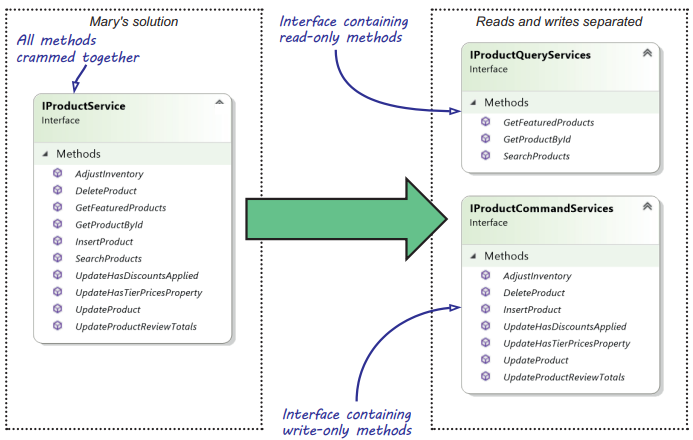

Chapter 6-Code Smells
==============================

A code smell is a hint that something might be wrong, not a certainty.Calling something a code smell is not an attack, it's a sign that a closer look is warranted.

## Abusing Abstract Factories to overcome lifetime problems


```C#
public interface IProductRepositoryFactory {
   IProductRepository Create();
}
```
Abstract Factories with parameterless Create methods are often used to allow consumers to control the lifetime of their Dependencies:

```C#
public class HomeController : Controller {
   private readonly IProductRepositoryFactory factory;

   public HomeController(IProductRepositoryFactory factory) {
      this.factory = factory;
   }

   public ViewResult Index() {
      using (IProductRepository repository = this.factory.Create()) {
         var products = repository.GetFeaturedProducts();
         return this.View(products);
      }  
   }
}
```
The problem with this code is, the consumer (HomeController) has to manage the lifetime of its dependency by explicitly callilng Dispose method, this makes `IProductRepository` a leaky abstraction.Becides, not of all implementations need to manage native resource, for example, `SQLProductRepository` needs to manage native resource since it connects to relational database, but `AzureProductRepository` or `XMLProductRepository` doesn't need. Again, it is a leaky abstraction because you have one particular implementation in mind. 

Even though all implementation needs to have native resource, letting consumer call Dispose explicitly place a burden on consumer. So again, the right solution is to use constructor injector with a proxy:
```C#
public class HomeController : Controller {
   private readonly IProductRepository repository;

   public HomeController(IProductRepository repository) {
      this.repository = repository;
   }

   public ViewResult Index() {
     var products = this.repository.GetFeaturedProducts(); 
     return this.View(products);
   }
}

// then you need to delay creation of SqlProductRepository using a Proxy
```
```C#
public class SqlProductRepositoryProxy : IProductRepository {
   private readonly string connectionString;

   public SqlProductRepositoryProxy(string connectionString) {
      this.connectionString = connectionString;
   }

   public IEnumerable<Product> GetFeaturedProducts() {
      using (var repository = this.Create()) {
         return repository.GetFeaturedProducts();
      }
   }

   private SqlProductRepository Create() {
      return new SqlProductRepository(this.connectionString);
   }
}

// SqlProductRepository still implement IDisposable
public class SqlProductRepository : IProductRepository, IDisposable { 
   ...
}

// AzureProductRepository doesn't implement IDisposable
public class AzureProductRepository : IProductRepository { 
   ...
}
```

<div class="alert alert-info p-1" role="alert">
    You might wonder what's the difference between proxy pattern and interception. The difference is interception takes an existing instance that has already been created while proxy create an instance by itself.
</div>

## Abusing Abstract Factories to select Dependencies based on runtime data

In the previous section, you learned that Abstract Factories should typically accept runtime values as input. Without them, you're leaking implementation details about the implementation to the consumer. This doesn’t mean that an Abstract Factory that accepts runtime data is the correct solution to every situation. More often than not, it isn't. 

The example we'll look at is the online mapping site that offers to calculate a route between two locations. To calculate a route, the application needs a routing algorithm, but it doesn't care which one. Each option represents a different algorithm, and the application can handle each routing algorithm as an Abstraction to treat them all equally. You must tell the application which algorithm to use, but you won’t know this until runtime because it's based on the user's choice.

```C#
public enum RouteType { Shortest, Fastest, Scenic }

public interface IRouteAlgorithm {
   RouteResult CalculateRoute(RouteSpecification specification);
}
```
Now you're presented with a problem. The RouteType is runtime data based on the user's choice. It's sent to the server with the request:
```C#
public class RouteController : Controller {
   ...
   public ViewResult GetRoute(RouteSpecification spec, RouteType routeType) {
      IRouteAlgorithm algorithm = ...;   // Gets the IRouteAlgorithm for the appropriate RouteType, but how?
      RouteResult route = algorithm.CalculateRoute(spec);
      ...
   }
}
```
The question now becomes, how do you get the appropriate algorithm? If you hadn't been reading this chapter, your knee-jerk reaction to this challenge would probably be to introduce an Abstract Factory, like this:

```C#
public interface IRouteAlgorithmFactory {
   IRouteAlgorithm CreateAlgorithm(RouteType routeType);
}

public class RouteController : Controller {
   private readonly IRouteAlgorithmFactory factory;

   public RouteController(IRouteAlgorithmFactory factory) {
      this.factory = factory;
   }

   public ViewResult GetRoute(RouteSpecification spec, RouteType routeType) {
      IRouteAlgorithm algorithm = this.factory.CreateAlgorithm(routeType);
      RouteResult route = algorithm.CalculateRoute(spec);
      ...
   }
}
```
The most simple implementation of IRouteAlgorithmFactory would involve a switch statement and return three different implementations of IRouteAlgorithm
based on the input.

Up until this point you might be wondering, "What's the catch? Why is this a code smell?" To be able to see the problem, we need to go back to the Dependency Inversion Principle.

#### Analysis of the code smell of Dependencies based on runtime data

In chapter 3 (section 3.1.2), we talked about the Dependency Inversion Principle. We discussed how it states that Abstractions should be owned by the layer using the Abstraction. We explained that it's the consumer of the Abstraction that should dictate its shape and define the Abstraction in a way that suits its needs the most. When we go back to our RouteController and ask ourselves whether this is the design that suits RouteController the best, we’d argue that this design doesn't suit RouteController.

One way of looking at this is by evaluating the number of Dependencies RouteController has, which tells you something about the complexity of the class. As you
saw in section 6.1, having a large number of Dependencies is a code smell, and a typical solution is to apply Facade Services refactoring.

When you introduce an Abstract Factory, you always increase the number of Dependencies a consumer has. If you only look at the constructor of RouteController, you may be led to believe that the controller only has one Dependency (`IRouteAlgorithmFactory`), but `IRouteAlgorithm` is also a Dependency of RouteController, even if it isn't injected into its constructor. This increased complexity might not be obvious at first, but it can be felt instantly when you start unit testing RouteController, not only you have to test/mock IRouteAlgorithmFactory, you also have to test/mock IRouteAlgorithm.

#### Refactoring toward a better solution

You can reduce the number of Dependencies by merging both IRouteAlgorithmFactory and IRouteAlgorithm together, much like you saw with the Facade Services
refactoring of section 6.1. Ideally, you'd want to use the Proxy pattern the same way you applied it in section 6.2.1. A Proxy, however, is only applicable in case the Abstraction is supplied with all the data required to select the appropriate Dependency. Unfortunately, this prerequisite doesn't hold for IRouteAlgorithm because it's only supplied with a RouteSpecification, but not a RouteType.

```C#
public interface IRouteCalculator {
   RouteResult Calculate(RouteSpecification spec, RouteType routeType);
}

public class RouteCalculator : IRouteCalculator {
   private readonly IDictionary<RouteType, IRouteAlgorithm> algorithms;

   public RouteCalculator(IDictionary<RouteType, IRouteAlgorithm> algorithms) {
      this.algorithms = algorithms;
   }

   public RouteResult Calculate(RouteSpecification spec, RouteType type) {
      return this.algorithms[type].CalculateRoute(spec);
   }
}

public class RouteController : Controller {
   private readonly IRouteCalculator calculator;

   public RouteController(IRouteCalculator calculator) {
      this.calculator = calculator;
   }

   public ViewResult GetRoute(RouteSpecification spec, RouteType routeType) {
      var route = this.calculator.Calculate(spec, routeType);
      ...
   }
}
```
By refactoring from Abstract Factory to an Adapter, you effectively reduce the number of Dependencies between your components:


```C#
// composition root
var algorithms = new Dictionary<RouteType, IRouteAlgorithm> { 
   { RouteType.Shortest, new ShortestRouteAlgorithm() }, 
   { RouteType.Fastest, new FastestRouteAlgorithm()
   { RouteType.Scenic, new ScenicRouteAlgorithm() };

new RouteController(new RouteCalculator(algorithms));
```
Typically, service Abstractions shouldn’t expose other service Abstractions in their definition. **This means that a service abstraction shouldn't accept another service abstractions as input, not should it have service abstractions as ouput parameters or as a return type.**

<div class="alert alert-info p-1" role="alert">
    The previous is more of a guideline than a strict rule. There certainly are exceptions where returning Abstractions makes the most sense, but beware that, when it comes to using them to resolve Dependencies, these situations aren't that common. For that reason, we see this as a code smell and not an anti-pattern.
</div>

## Fixing cyclic Dependencies
Occasionally, Dependency implementations turn out to be cyclic. An implementation requires another Dependency whose implementation requires the first Abstraction. Such a Dependency graph can't be satisfied as picture below shows:


In this section, we'll look into the issue concerning cyclic Dependencies, including an example. When we’re finished, your first reaction should be to try to redesign your Dependencies, because the problem is typically caused by your application's design. The main takeaway from this section, therefore, is this: **Dependency cycles are typically caused by an SRP violation.**

If redesigning your Dependencies isn't possible, you can break the cycle by refactoring from Constructor Injection to Property Injection. This represents a loosening of a class's invariants, so it isn't something you should do lightly

#### Example: Dependency cycle caused by an SRP violation

A new feature is required to added to Mary's e-commerce so that the application can store changes in an auditing table that records every change that every user in the system makes.

After thinking about this for some time, Mary comes up with the definition for an IAuditTrailAppender Abstraction:
```C#
public interface IAuditTrailAppender {
   void Append(Entity changedEntity);
}

public class SqlAuditTrailAppender : IAuditTrailAppender {
   private readonly IUserContext userContext;
   private readonly CommerceContext context;
   private readonly ITimeProvider timeProvider;

   public SqlAuditTrailAppender(IUserContext userContext, CommerceContext context, ITimeProvider timeProvider) {
      this.userContext = userContext;
      this.context = context;
      this.timeProvider = timeProvider;
   }

   public void Append(Entity changedEntity) {
      AuditEntry entry = new AuditEntry {
         UserId = this.userContext.CurrentUser.Id,
         TimeOfChange = this.timeProvider.Now, 
         EntityId = entity.Id,
         EntityType = entity.GetType().Name
      };

      this.context.AuditEntries.Add(entry);
   }
}
```
An important part of an audit trail is relating a change to a user. To accomplish this, SqlAuditTrailAppender requires an IUserContext Dependency:


```C#
public class AspNetUserContextAdapter : IUserContext {
   private static HttpContextAccessor Accessor = new HttpContextAccessor();

   private readonly IUserRepository repository; 

   public AspNetUserContextAdapter(IUserRepository repository) {
      this.repository = repository;
   }

   public User CurrentUser {
      get {
         var user = Accessor.HttpContext.User;
         string userName = user.Identity.Name;
         return this.repository.GetByName(userName);
      }
   }
}
```
Mary's next step is to update the classes that need to be appended to the audit trail. One of the classes that needs to be updated is SqlUserRepository:
```C#
public class SqlUserRepository : IUserRepository {
   public SqlUserRepository(CommerceContext context, IAuditTrailAppender appender) {
      this.appender = appender;
      this.context = context;
   }

   public void Update(User user) {
      this.appender.Append(user);
   }

   public User GetById(Guid id) { ... } 

   public User GetByName(string name) { ... }   // <--- used by CurrentUser property of AspNetUserContextAdapter
}
```
But Mary can't really composite all components together because of Dependency cycle as picture below shows:


The cyclic dependence is due to SRP violations, but why letting `SqlUserRepository` has a dependency of `IAuditTrailAppender` is a SRP violation? Because when we injected the IAuditTrailAppender interface into the SqlUserRepository itself, we forced it to know about and to implement auditing, which is a Single Responsibility Principle violation. The Single Responsibility Principle suggests that we shouldn't let `SqlUserRepository` depends on `IAuditTrailAppender`, using a Decorator is a better alternarive.

How Decorator Pattern solve this problem will be covered in chapter 9, but for now, let's just use a workaround to fix this cyclic dependence issue, this workaround is just a workaround to show how to break the dependency that causes cyclic dependence, to really fix the issue correct fundenmentally, you need to use decorator pattern.

#### Refactoring from SRP violations to resolve the Dependency cycle

We create a new interace `IUserByNameRetriever` (just a workaround) and move GetByName into this interface


```C#
public interface IUserByNameRetriever {
   User GetByName(string name);
}

public class SqlUserByNameRetriever : IUserByNameRetriever {
   public SqlUserByNameRetriever(CommerceContext context) {
      this.context = context;
   }

   public User GetByName(string name) { ... }
}

public class SqlUserRepository : IUserRepository {
   public SqlUserRepository(CommerceContext context, IAuditTrailAppender appender) {
      this.appender = appender;
      this.context = context;
   }

   public void Update(User user) {
      this.appender.Append(user);
   }

   public User GetById(Guid id) { ... } 

   /*
      don't need this method in this case, as mentioned before, it is a workaround, when using Decorator, SqlUserRepository can still have GetByName method as 
      it is nature to be able to search users by both id and name
   */
   //public User GetByName(string name) { ... }                                              
}

public class AspNetUserContextAdapter : IUserContext {
   private static HttpContextAccessor Accessor = new HttpContextAccessor();

   private readonly IUserByNameRetriever retriever; 

   public AspNetUserContextAdapter(IUserByNameRetriever retriever) {
      this.retriever = retriever;
   }

   public User CurrentUser {
      get {
         var user = Accessor.HttpContext.User;
         string userName = user.Identity.Name;
         return this.retriever.GetByName(userName);
      }
   }
}
```


## Dealing with the Constructor Over-injection Code Smell

Unless you have special requirements, Constructor Injection should be your preferred injection pattern. Although Constructor Injection is easy to implement and use, it makes developers uncomfortable when their constructors start looking something like that shown next:
```C#
public class OrderService {
   ...
   public OrderService(IOrderRepository orderRepository,
                       IMessageService messageService,
                       IBillingSystem billingSystem,
                       ILocationService locationService,
                       IInventoryManagement inventoryManagement) {

      this.orderRepository = orderRepository;
      ...
      this.inventoryManagement = inventoryManagement;
   }
   
}
```
Having many Dependencies is an indication of a Single Responsibility Principle (SRP) violation. SRP violations lead to code that's hard to maintain. 

We can't say we blame anyone for disliking a constructor as shown in above, but don't blame Constructor Injection. We can agree that a constructor with five parameters is a code smell, but it indicates a violation of the SRP rather than a problem related to DI. 

Our personal threshold lies at four constructor arguments. When we add a third argument, we already begin considering whether we could design things differently, but we can live with four arguments for a few classes. Your limit may be different, but when you cross it, it's time to investigate.

<div class="alert alert-info pt-2 pb-0" role="alert">
    A tempting, but erroneous, attempt to resolve Constructor Over-injection is through the introduction of Property Injection, perhaps even by moving those properties into a base class. Although the number of constructor Dependencies can be reduced by replacing them with properties, such a change doesn't lower the class's complexity, which should be your primary focus.
</div>

Table below provides an overview of the order process:


```C#
public class OrderService : IOrderService 
{
   private readonly IOrderRepository orderRepository;
   private readonly IMessageService messageService;
   private readonly IBillingSystem billingSystem;
   private readonly ILocationService locationService;
   private readonly IInventoryManagement inventoryManagement;

   public OrderService(IOrderRepository orderRepository, IMessageService messageService, IBillingSystem billingSystem, ILocationService locationService, IInventoryManagement inventoryManagement) {
      this.orderRepository = orderRepository;
      this.messageService = messageService;
      this.billingSystem = billingSystem;
      this.locationService = locationService;
      this.inventoryManagement = inventoryManagement;
   }
   
   public void ApproveOrder(Order order) {
      UpdateOrder(order);   // Updates the database with the order's new status
      Notify(order);        // Notifies other systems about the order
   }

   private void UpdateOrder(Order order) {   // interact with EF, that's why it is a private method
      order.Approve();
      orderRepository.Save(order);
   }

   private void Notify(Order order) {
      messageService.SendReceipt(new OrderReceipt { ... });
      billingSystem.NotifyAccounting(...);
      Fulfill(order);
   }

   private void Fulfill(Order order) {
      locationService.FindWarehouses(...);   // Finds closest warehouse
      inventoryManagement.NotifyWarehouses(...);   // Notifies warehouse about order
   }
}
```


## Refactoring from Constructor Over-injection to Facade Services

When redesigning `OrderService`, the first thing you need to do is to look for natural clusters of interaction. The interaction between `ILocationService` and `IInventoryManagement` should immediately draw your attention, because you use them to find the closest warehouses that can fulfull the order. After you've selected the warehouses, you need to notify them about the order. If you think about this a little further, ILocationService is an implementation detail of notifying the appropriate warehouses about the order. The entire interaction can be hidden behind an IOrderFulfillment interface, like this:
```C#
public interface IOrderFulfillment {
   void Fulfill(Order order);
}

public class OrderFulfillment : IOrderFulfillment {
   private readonly ILocationService locationService;
   private readonly IInventoryManagement inventoryManagement;

   public OrderFulfillment(ILocationService locationService, IInventoryManagement inventoryManagement) {
      this.locationService = locationService;
      this.inventoryManagement = inventoryManagement;
   }

   public void Fulfill(Order order) {
      locationService.FindWarehouses(...);
      inventoryManagement.NotifyWarehouses(...);
   }
}

public class OrderService : IOrderService {
   ... 
   // now we reduce one injection, better than before but still not the best
   public OrderService(IOrderRepository orderRepository, IMessageService messageService, IBillingSystem billingSystem, IOrderFulfillment orderFulfullment) {
      this.orderRepository = orderRepository;
      this.messageService = messageService;
      this.billingSystem = billingSystem;
      this.orderFulfullment = orderFulfullment;
   }
   ...
   ...
   private void Notify(Order order) {
      messageService.SendReceipt(new OrderReceipt { ... });
      billingSystem.NotifyAccounting(...);
      orderFulfullment.Fulfill(order);
   }

   /*
   private void Fulfill(Order order) {
      locationService.FindWarehouses(...);   // Finds closest warehouse
      inventoryManagement.NotifyWarehouses(...);   // Notifies warehouse about order
   }
   */
}
```
The new `IOrderFulfillment` Abstraction is a ***Facade Service*** because it hides the two interacting dependencies with their behavior.

A **Facade Service** hides a natural cluster of interacting Dependencies, along with their behavior, behind a single Abstraction.

This refactoring merges two Dependencies into one but leaves you with four Dependencies on the OrderService class, as shown in figure below:
 


The OrderService class only has four Dependencies, and the OrderFulfillment class contains two. That's not a bad start, but you can simplify OrderService even more. The next thing you may notice is that all the requirements involve notifying other systems about the order (`ApproveOrder` method calls `Notify` method which will interact with `IMessageService` and `IBillingSystem`, plus the new design `IOrderFulfillment`). This suggests that you can define a common Abstraction that models notification, like this:
```C#
public interface INotificationService {
   void OrderApproved(Order order);
}
```
Each notification to an external system can be implemented using this interface, for example:
```C#
public class OrderFulfillment : INotificationService {   // not implementing IOrderFulfillment anymore
   private readonly ILocationService locationService;
   private readonly IInventoryManagement inventoryManagement;

   public OrderFulfillment(ILocationService locationService, IInventoryManagement inventoryManagement) {
      this.locationService = locationService;
      this.inventoryManagement = inventoryManagement;
   }

   public void OrderApproved(Order order) {
      locationService.FindWarehouses(...);
      inventoryManagement.NotifyWarehouses(...);
   }
}

public class OrderApprovedReceiptSender : INotificationService {   
  private readonly IMessageService messageService;

   public OrderApprovedReceiptSender(IMessageService messageService) {
      this.messageService = messageService;
   }

   public void OrderApproved(Order order) {
      messageService.SendReceipt(new OrderReceipt { ... });
   }
}

public class AccountingNotifier : INotificationService {   
  private readonly IBillingSystem billingSystem;

   public AccountingNotifier(IBillingSystem billingSystem) {
      this.billingSystem = billingSystem;
   }

   public void OrderApproved(Order order) {
      billingSystem.NotifyAccounting(...);
   }
}
```
But you may wonder how this helps, because you've wrapped each Dependency in a new interface. The number of Dependencies didn't decrease, so did you gain
anything?

Yes, you did. Because all three notifications implements the same interface, you can wrap them in a Composite pattern as below:
```C#
public class CompositeNotificationService : INotificationService {   // implement the same INotificationService
   private readonly IEnumerable<INotificationService> services;

   public CompositeNotificationService(IEnumerable<INotificationService> services) {   // Wraps a sequence of INotificationService instances
      this.services = services;
   }

   public void OrderApproved(Order order) {
      foreach (var service in this.services) {
         service.OrderApproved(order);   // Forwards an incoming call to all wrapped instances
      }
   }
}  
```
now you can refactore `OrderService` with two Dependencies:
```C#
public class OrderService : IOrderService {
   private readonly IOrderRepository orderRepository;
   private readonly INotificationService notificationService;

   public OrderService(IOrderRepository orderRepository, INotificationService notificationService) {
      this.orderRepository = orderRepository;
      this.notificationService = notificationService;
   }

   public void ApproveOrder(Order order) {
      this.UpdateOrder(order);
      this.notificationService.OrderApproved(order);
   }
}
```


At a high level, you don't need to care about the details of how OrderService notifies other systems, but you do care that it does. This reduces OrderService to only two Dependencies, which is a more reasonable number. From the consumer's perspective, OrderService is functionally unchanged, making this a true refactoring. On the other hand, on the conceptual level, OrderService is changed. Its responsibility is now to receive an order, save it, and notify other systems.

Using the `CompositeNotificationService`, you can now create the `OrderService` with its Dependencies:
```C#
var repository = new SqlOrderRepository(connectionString);

INotificationService notificationService = new CompositeNotificationService(
   new INotificationService[] {
      new OrderApprovedReceiptSender(messageService),
      new AccountingNotifier(billingSystem),
      new OrderFulfillment(locationService, inventoryManagement)
   }
);

var orderServive = new OrderService(repository, notificationService);
```
The Facade Services refactoring is a great way to handle complexity in a system. But with regard to the OrderService example, we might even take this one step further, bringing us to domain events.

## Refactoring from Constructor Over-injection to Domain Events

We can say that the act of an order being approved is of importance to the business. These kinds of events are called domain events, and it might be valuable to model them more explicitly in your applications.

The essence of a domain event is that you use it to capture actions that can trigger a change to the state of the application you're developing.

Although the introduction of INotificationService is a great improvement to OrderService, it only solves the problem at the level of OrderService and its direct Dependencies. When applying the same refactoring technique to other classes in the system, one could easily imagine how INotificationService evolves toward something similar to the following listing:


```C#
public class OrderService : IOrderService {
   private readonly IOrderRepository orderRepository;
   private readonly INotificationService notificationService;

   public OrderService(IOrderRepository orderRepository, INotificationService notificationService) {
      this.orderRepository = orderRepository;
      this.notificationService = notificationService;
   }

   public void ApproveOrder(Order order) {
      ...
   }

   public void CancelOrder(Order order) {
      ...
   }

   public void CustomerMadePreferred(Customer customer) {
      ...
   }
}
```
that causes `INotificationService` needs to be extended to
```C#
public interface INotificationService {
   void OrderApproved(Order order);
   void OrderCancelled(Order order);
   void OrderShipped(Order order);
   void OrderDelivered(Order order); 
   void CustomerCreated(Customer customer);
   void CustomerMadePreferred(Customer customer);
   ...
}
```
And all existing implementation have to be modified, e.g:
```C#
public class OrderNotification : INotificationService {   
  private readonly IMessageService messageService;

   public OrderApprovedReceiptSender(IMessageService messageService) {
      this.messageService = messageService;
   }

   public void OrderApproved(Order order) {
      messageService.SendReceipt(...);
   }

   public void OrderCancelled(Order order) {
      messageService.SendCancelConfirmation(...);
   }

   ...

   public void CustomerMadePreferred(Customer customer) {   // violate ISP
      // do nothing as Order Notification has nothing to do with Customer
   }
}
```

Within any system of reasonable size and complexity, you'd easily get dozens of these domain events, which would lead to an ever-changing INotificationService interface. With each change to this interface, all implementations of that interface must be updated too. If, however, you promote the domain events to actual types and make them part of the domain, as shown in figure 6.4, an interesting opportunity to generalize even further arises:


The following listing shows the domain event code:

```C#
public class OrderApproved {
   public readonly Guid OrderId;

   public OrderApproved(Guid orderId) {
      this.OrderId = orderId;
   }
}

public class OrderCancelled {
   public readonly Guid OrderId;

   public OrderCancelled(Guid orderId) {
      this.OrderId = orderId;
   }
}
```
Although both the OrderApproved and OrderCancelled classes have the same structure and are related to the same Entity, modelling them around their own class makes it easier to create code that responds to such a specific event. When each domain event in your system gets its own type, it lets you change `INotificationService` to a generic interface with a single method, as the following listing shows:

```C#
// We changed the name from INotificationService to IEventHandler to make it more apparent that this interface has a wider scope than just notifying others 
public interface IEventHandler<TEvent> {    
   void Handle(TEvent e);
}
```

Based on this interface, you can now build the classes that respond to a domain event, the original `OrderFulfillment` class changes to that displayed in the following listing:
```C#
public class OrderFulfillment : IEventHandle<OrderApproved> {
   private readonly ILocationService locationService;
   private readonly IInventoryManagement inventoryManagement;

   public OrderFulfillment(ILocationService locationService, IInventoryManagement inventoryManagement) {
      this.locationService = locationService;
      this.inventoryManagement = inventoryManagement;
   }

   public void Handle(OrderApproved e) {
      this.locationService.FindWarehouses(...);
      this.inventoryManagement.NotifyWarehouses(...);
   }
}

public class OrderApprovedReceiptSender : IEventHandle<OrderApproved> {   
  private readonly IMessageService messageService;

   public OrderApprovedReceiptSender(IMessageService messageService) {
      this.messageService = messageService;
   }

   public void Handle(OrderApproved e) {
      messageService.SendReceipt(new OrderReceipt { ... });
   }
}

public class AccountingNotifier : IEventHandle<OrderApproved> {   
  private readonly IBillingSystem billingSystem;

   public AccountingNotifier(IBillingSystem billingSystem) {
      this.billingSystem = billingSystem;
   }

   public void Handle(OrderApproved e) {
      billingSystem.NotifyAccounting(...);
   }
}
```
and the new Composite:
```C#
public class CompositeEventHandler<TEvent> : IEventHandler<TEvent> {
   private readonly IEnumerable<IEventHandler<TEvent>> handlers;

   public CompositeEventHandler(IEnumerable<IEventHandler<TEvent>> handlers) {
      this.handlers = handlers;
   }

   public void Handle(TEvent e) {
      foreach (var handler in this.handlers) {
         handler.Handle(e);
      }
   }
}
```


The `OrderService` logic will stay almost unchanged:
```C#
public class OrderService  {
   private readonly IOrderRepository orderRepository;
   private readonly IEventHandler<OrderApproved> handler;

   public OrderService(IOrderRepository orderRepository, IEventHandler<OrderApproved> handler) {
      this.orderRepository = orderRepository;
      this.handler = handler;
   }

   public void ApproveOrder(Order order) {
      this.UpdateOrder(order);
      this.handler.Handle(new OrderApproved(order.Id));   // create an OrderApproved domain event and send it to the appropriate handlers for processing.
   }
}
```
now you can create the `OrderService` in Composition Ro with its Dependencies:
```C#
var orderRepository = new SqlOrderRepository(connectionString);

CompositeEventHandler<OrderApproved> orderApprovedHandler = new CompositeEventHandler<OrderApproved>(
   new IEventHandler<OrderApproved>[] {
      new OrderApprovedReceiptSender(messageService),
      new AccountingNotifier(billingSystem),
      new OrderFulfillment(locationService, inventoryManagement)
   }
);

var orderService = new OrderService(orderRepository, orderApprovedHandler);
```
The following code shows a few more event handlers for OrderCancelled:
```C#
public class OrderService : IOrderService {
   private readonly IOrderRepository orderRepository;
   private readonly IEventHandler<OrderApproved> approvedHandler;
   private readonly IEventHandler<OrderCancelled> canceledHandler;


   public OrderService(IOrderRepository orderRepository, IEventHandler<OrderApproved> approvedHandler, IEventHandler<OrderCancelled> canceledHandler) {
      this.orderRepository = orderRepository;
      this.approvedHandler = approvedHandler;
      this.canceledHandler = canceledHandler;
   }

   public void ApproveOrder(Order order) {
      this.UpdateOrder(order);
      this.approvedHandler.Handle(new OrderApproved(order.Id));   
   }

   public void CancelOrder(Order order) {
      this.UpdateOrder(order);
      this.canceledHandler.Handle(new OrderCancelled(order.Id));   
   }
}

public class AccountingNotifier : IEventHandle<OrderApproved>, IEventHandler<OrderCancelled> {   
  private readonly IBillingSystem billingSystem;

   public AccountingNotifier(IBillingSystem billingSystem) {
      this.billingSystem = billingSystem;
   }

   public void Handle(OrderApproved e) {
      billingSystem.NotifyAccounting(...);
   }

   public void Handle(OrderCancelled e) {
      ...
   }
}
// add IEventHandler<OrderCancelled> for RefundSender etc as well
```
composite all components:
```C#
CompositeEventHandler<OrderApproved> orderApprovedHandler =  new CompositeEventHandler<OrderApproved>(
   new IEventHandler<OrderApproved>[] {
      new OrderApprovedReceiptSender(messageService),
      new AccountingNotifier(billingSystem),
      new OrderFulfillment(locationService, inventoryManagement)
   }
);

CompositeEventHandler<OrderCancelled> orderCancelledHandler = new CompositeEventHandler<OrderCancelled>(
  new IEventHandler<OrderCancelled>[] {
     new AccountingNotifier(billingSystem),
     new RefundSender(orderRepository)
  }
);

var orderService = new OrderService(orderRepository, orderApprovedHandler, orderCancelledHandler)
// ever-growing OrderService class
// var orderService = new OrderService(orderRepository, orderApprovedHandler, orderCancelledHandler, OrderShipped, OrderDelivered, ...)  
```
New building blocks can be plugged in without the need to change any existing business logic. A DI Container's Auto-Registration abilities is a great way to simplify your Composition Root. Chapters 13, 14, and 15 show how to register `IEventHandler<TEvent>` implementations using a DI Container.

To sum up:
```C#
// old version, too many dependencies in the constructer
public class OrderService : IOrderService 
{
   ...
   public OrderService(IOrderRepository orderRepository, IMessageService messageService, IBillingSystem billingSystem, ILocationService locationService, IInventoryManagement inventoryManagement) {
     ...
   }   
   public void ApproveOrder(Order order) {
      ...
   }

   public void CancelOrder(Order order) {
      ...
   }
   ...
}

// new version, minimise the number of dependencies in the constructer
public class OrderService : IOrderService {
   ...
   public OrderService(IOrderRepository orderRepository, IEventHandler<OrderApproved> approvedHandler, IEventHandler<OrderCancelled> canceledHandler) {
      ...
   }

   public void ApproveOrder(Order order) {
      ...
   }

   public void CancelOrder(Order order) {
      ...
   }
   ...
}

// we change from old version to new version by creating a wrapping class that implements IEventHandler<TEvent>, e.g
public class OrderApprovedReceiptSender : IEventHandle<OrderApproved> {    // OrderApprovedReceiptSender is a new wrapped class that holds IMessageService
  private readonly IMessageService messageService;

   public OrderApprovedReceiptSender(IMessageService messageService) {
      this.messageService = messageService;
   }

   public void Handle(OrderApproved e) {
      messageService.SendReceipt(new OrderReceipt { ... });
   }
}
```

<div class="alert alert-info p-1" role="alert">
    You wouldn't use the same technique to create a wrapper class for core services such as IOrderRepository or IMessageService, because they are in "low layer", so they won't have too many dependencies in their constructors. You only use this technique for one layer up business operation related classes such as OrderService and IProductService because they might have many dependencies in their constructors.
</div>

Although the introduction of `IEventHandler<TEvent>` prevented the problem of an ever-growing `INotificationService`, it doesn't prevent the problem of an ever-growing `OrderService` class, for example, the `IOrderService` can be extended to:
```C#
// original version
public interface IOrderService {    
   void ApproveOrder(Order order);
}

// new version as new features are added
public interface IOrderService {    
   void ApproveOrder(Order order);
   void Cancelled(Order order);
   void ShipOrder(Order order);
   void OnHoldOrder(Order order);
   ...
}

public class OrderService : IOrderService {
   ...
   // OrderService's constructor still growing
   public OrderService(IOrderRepository orderRepository, IEventHandler<OrderApproved> approvedHandler, IEventHandler<OrderCancelled> canceledHandler
                       IEventHandler<ShipOrder> shippedHandler, IEventHandler<OnHoldOrder> onholdHandler, ...) {
      ...
   }

   public void ApproveOrder(Order order) {
      ...
   }

   public void CancelOrder(Order order) {
      ...
   }
   ...
}
```
This is something we'll address in great detail in "Chapter 10-Aspect Oriented Programming by Design". You will see `IOrderService` is similar to `IProductService` that we can apply some AOP techniques:




You will see the technique we learned in this chapter solves the problem that an implementation service like `OrderService` has too many depdendencies in its constructor while AOP solves too many "methods" in `OrderService`. So Domain Event corresponds to the method such as ApproveOrder while Parameter Object corresponds to the parameters of ApproveOrder method. Domain Events maps the abstract of the implementation, e.g Domain Event `OrderApproved` and `OrderCancelled` map the `ApproveOrder` and `CancelOrder` of `IOrderService`. Domain Events aim to reduce the implementation's (`OrderService`) dependencies while AOP aims to reduces the method number of an abstraction (`IOrderService`).

Below is the comparision:
```C#
// Before AOP
public class OrderService : IOrderService {
   private readonly IOrderRepository orderRepository;
   private readonly IEventHandler<OrderApproved> approvedHandler;
   private readonly IEventHandler<OrderCancelled> canceledHandler;

   public OrderService(IOrderRepository orderRepository, IEventHandler<OrderApproved> approvedHandler, IEventHandler<OrderCancelled> canceledHandler) {
      ...
   }

   public void ApproveOrder(Order order) {
      this.UpdateOrder(order);
      this.approvedHandler.Handle(new OrderApproved(order.Id));   
   }

   public void CancelOrder(Order order) {
      this.UpdateOrder(order);
      this.canceledHandler.Handle(new OrderCancelled(order.Id));   
   }
}

// After AOP
public interface ICommandService<TCommand> {
   void Execute(TCommand command);
}

public class ApproveOrderService : ICommandService<ApproveOrder> {
   private readonly IOrderRepository orderRepository;
   private readonly IEventHandler<OrderApproved> approvedHandler;

   public OrderApproveService(IOrderRepository orderRepository, IEventHandler<OrderApproved> approvedHandler) {
      ...
   }

   public void Execute(ApproveOrder command) {
      Order order = this.repository.GetById(command.OrderId);
      order.Approve();
      this.repository.Save(order);

      this.approvedHandler.Handle(new OrderApproved(command.OrderId));   
   }
}

public class OrderCancelService : ICommandService<CancelOrder> {
   private readonly IOrderRepository orderRepository;
   private readonly IEventHandler<OrderCancelled> canceledHandler;

   public OrderApproveService(IOrderRepository orderRepository, IEventHandler<OrderCancelled> canceledHandler) {
      ...
   }

   public void CancelOrder(CancelOrder command) {
      Order order = this.repository.GetById(command.OrderId);
      order.Cancel();
      this.repository.Save(order);

      this.canceledHandler.Handle(new OrderCancelled(command.OrderId));   
   }
}
```
Note the difference between Domain Events (e.g `OrderApproved`, note the "ed" suffix) and Parameter Objects (`ApproveOrder`), it is hard to spot the differences so let's look at a concrete example:
```C#
// Parameter Object
public class AdjustInventory
{
   [RequiredGuid]
   public Guid ProductId { get; set; }
   public bool Decrease { get; set; }

   [Range(minimum: 1, maximum: 10000)]
   public int Quantity { get; set; }
}

// Domain Event
public class InventoryAdjusted
{
   public readonly Guid ProductId;
   public readonly int QuantityAdjustment;

   public InventoryAdjusted(Guid productId, int quantityAdjustment) {
      this.ProductId = productId;
      this.QuantityAdjustment = quantityAdjustment;
   }
}

// business aspect
public class AdjustInventoryService : ICommandService<AdjustInventory>
{
   private readonly IInventoryRepository repository;
   private readonly IEventHandler<InventoryAdjusted> handler;

   public AdjustInventoryService(IInventoryRepository repository, IEventHandler<InventoryAdjusted> handler)
      ...
   }

   public void Execute(AdjustInventory command) {
      int quantityAdjustment = command.Quantity * (command.Decrease ? -1 : 1);

      var productInventory = this.repository.GetByIdOrNull(command.ProductId)?? new ProductInventory { Id = command.ProductId };

      productInventory.Quantity += quantityAdjustment;

      if (productInventory.Quantity < 0) throw new InvalidOperationException("Can't decrease below 0.");

      this.repository.Save(productInventory);

      this.handler.Handle(new InventoryAdjusted(command.ProductId, quantityAdjustment));
   }
}

// controller
public class InventoryController : Controller {
   private readonly IProductRepository repository;
   private readonly ICommandService<AdjustInventory> inventoryAdjuster;

   public InventoryController(IProductRepository repository, ICommandService<AdjustInventory> inventoryAdjuster) {
            
   }

   [Route("inventory/adjustinventory")]
   public ActionResult AdjustInventory(AdjustInventoryViewModel viewModel) {
      if (!this.ModelState.IsValid) {
                return this.View(nameof(Index), this.Populate(viewModel));
      }

      AdjustInventory command = viewModel.Command;

      inventoryAdjuster.Execute(command);

       TempData["SuccessMessage"] = "Inventory successfully adjusted.";

      return this.RedirectToAction(nameof(HomeController.Index), "Home");
   }       
}
```
You can see that Parameter Objects is more connected to "front end" such as model binding model and consumed by the bore business service implementation `AdjustInventoryService`, while Domain Events is more connected to the service implementation's dependencies (wrapped as `IEventHandler<InventoryAdjusted>`) and passed to those dependencies' methods as parameters.


<!-- <div class="alert alert-info p-1" role="alert">
    
</div> -->

<!--  -->

<!-- <code>&lt;T&gt;</code> -->

<!-- <div class="alert alert-info pt-2 pb-0" role="alert">
    <ul class="pl-1">
      <li></li>
      <li></li>
    </ul>  
</div> -->

<!-- <ul>
  <li><b></b></li>
  <li><b></b></li>
  <li><b></b></li>
  <li><b></b></li>
</ul>  -->

<!-- <span style="color:red">hurt</span> -->

<style type="text/css">
.markdown-body {
  max-width: 1800px;
  margin-left: auto;
  margin-right: auto;
}
</style>

<link rel="stylesheet" href="./zCSS/bootstrap.min.css">
<script src="./zCSS/jquery-3.3.1.slim.min.js"></script>
<script src="./zCSS/popper.min.js"></script>
<script src="./zCSS/bootstrap.min.js"></script>