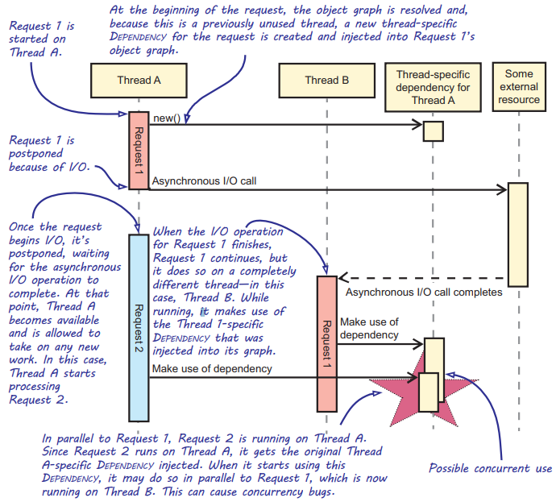

Chapter 8-Object Lifetime
==============================

## Pure DI and Different Scopes

```C#
// startup.cs
public void ConfigureServices(IServiceCollection services) {
   ...
   string connectionString = Configuration.GetConnectionString("CommerceConnection");   
   services.AddSingleton<IControllerActivator>(new CommerceControllerActivator(connectionString));   
}
```

```C#
namespace Microsoft.AspNetCore.Mvc.Controllers {
   public interface IControllerActivator {
      object Create(ControllerContext context);
      void Release(ControllerContext context, object controller);
   }
}

// only one instance of CommerceControllerActivator is used to create mutiple controller instance
public class CommerceControllerActivator : IControllerActivator {   // CommerceControllerActivator is the composer
   private readonly string connectionString;
   private readonly IUserContext userContext;   // <--- Singleton

   public CommerceControllerActivator(string connectionString) {
      this.connectionString = connectionString;
      this.userContext = new AspNetUserContextAdapter();
   }

   public object Create(ControllerContext ctx) {
      Type type = ctx.ActionDescriptor.ControllerTypeInfo.AsType();
      CommerceContext dbContext = new CommerceContext(connectionString);   // Scoped
      switch (type.Name) {
            case "HomeController":
               return CreateHomeController(dbContext);
            //case "RouteController":
            //   return this.CreateRouteController();
            default:
               throw new Exception("Unknown controller " + type.Name);
      }
   }

   // asp.net handles each request by new up a new instance of the controller
   private HomeController CreateHomeController(CommerceContext dbContext) {
      
      return new HomeController(new ProductService(new SqlProductRepository(dbContext), this.userContext));   // <--- Transient e.g ProductService
   }

   public void Release(ControllerContext context, object controller) {
      // implement it later
   }
}
```

<div class="alert alert-info p-1" role="alert">
    Singleton instances should be thread-safe, DbContext instances aren't thread-safe,  but you typically only want to have one DbContext instance per web request (Scoped). This will be covered in later section in this chapter.
</div>

## Working with disposable Dependencies

It's likely that some Dependency implementations will contain unmanaged resources. As an example, ADO.NET connections are disposable because they tend to
use unmanaged memory. As a result, database-related implementation like Repositories backed by database are likely to be disposable themselves. How should we model disposable Dependencies? Should we also let Abstractions be disposable? That might look like this:


```C#
public interface IMyDependency : IDisposable   // Leaky Abstraction

```
If you feel the urge to add IDisposable to your interface, it's probably because you have a particular implementation in mind. But you must not let that knowledge leak through to the interface design. Doing so would make it more difficult for other classes to implement the interface and would introduce vagueness into the Abstraction.

For the sake of argument, imagine that you have a disposable Abstraction like the following IOrderRepository interface:


```C#
public interface IOrderRepository : IDisposable
```

Most design guidelines would insist that if a class holds a disposable resource as a member, it should itself implement IDisposable and dispose of the resource. The next listing shows how:


```C#
public sealed class OrderService : IDisposable {   // OrderService also implements IDisposable because of its IOrderRepository dependency 
   private readonly IOrderRepository repository;

   public OrderService(IOrderRepository repository) {
      this.repository = repository;
   }

   public void Dispose() {
      this.repository.Dispose();
   }
}
```
But this turns out to be a bad idea because the repository member was originally injected, and it can be shared by other consumers:
```C#
var repository = new SqlOrderRepository(connectionString);

var validator = new OrderValidator(repository);
var orderService = new OrderService(repository);

orderService.AcceptOrder(order);
orderService.Dispose();

validator.Validate(order);   // This causes exceptions to be thrown when OrderValidator tries to use it in its Validate method.
```
It would be less dangerous not to dispose of the injected Repository, but this means you're ignoring the fact that the Abstraction is disposable. Besides, in this case, the Abstraction exposes more members than used by the client, which is an Interface Segregation Principle violation. Declaring an Abstraction as deriving from IDisposable provides no benefit.

Then again, there can be scenarios where you need to signal the beginning and end of a short-lived scope; IDisposable is sometimes used for that purpose. Before we examine how a Composer can manage the lifetime of a disposable Dependency, we should consider how to deal with such ephemeral disposables.

**An *ephermeral disposable* is an object with a clear and short lifetime that typically doesn't exceed a single method call.** 
For example, in Chapter 6, the `Create` method creates an ephermeral disposable:
```C#
public class SqlProductRepositoryProxy : IProductRepository {
   private readonly string connectionString;

   public SqlProductRepositoryProxy(string connectionString) {
      this.connectionString = connectionString;
   }

   public IEnumerable<Product> GetFeaturedProducts() {
      using (var repository = this.Create()) {
         return repository.GetFeaturedProducts();
      }
   }

   private SqlProductRepository Create() {
      return new SqlProductRepository(this.connectionString);
   }
}
```

## Managing Disposable Dependencies

Because disposable abstractions are leaky abstractions, the consequence is that abstractions shouldn't be disposable. On the other hand, sometimes implementations are disposable; if you don't properly dispose of them, you'll have resource leaks in your applications, Someone or something must dispose of them.

As always, this responsibility falls on the Composer. It's easy for the Composer to keep a reference to the disposable instance and invoke its Dispose method at an appropriate time. The challenge lies in identifying when it's the appropriate time. How do you know when all consumers have gone out of scope?

In ASP.NET Core, At the end of a web request, the framework tells IControllerActivator, which is typically our Composer, that it should release all Dependencies for a given object, It's then up to the Composer to keep track of those Dependencies and to decide whether anything must be disposed of based on
their Lifestyles.

Let's go back to the CommerceControllerActivator example before. As it turns out, there's a bug in that listing, because CommerceContext implements IDisposable. The code creates new instances of CommerceContext, but it never disposes of those instances. This could cause resource leaks, so let’s fix that bug with a new version of the Composer.

First, keep in mind that the Composer for a web application must be able to service many concurrent requests, so it has to associate each CommerceContext instance with the request it's associated with:
```C#
private HomeController CreateHomeController(ControllerContext context) {
   CommerceContext dbContext = new CommerceContext(this.connectionString);

   TrackDisposable(context, dbContext);   // Tracks that instance by associating it with the current request

   return new HomeController(new ProductService(new SqlProductRepository(dbContext),this.userContext));
}

private static void TrackDisposable(ControllerContext context, IDisposable disposable) {
   IDictionary<object, object> items = context.HttpContext.Items;

   object list;

   if (!items.TryGetValue("Disposables", out list)) {
      list = new List<IDisposable>(); 
      items["Disposables"] = list; 
   }

   ((List<IDisposable>)list).Add(disposable);
}
```
`CommerceControllerActivator`'s Release method:
```C#
public void Release(ControllerContext context, object controller) {
   var disposables = (List<IDisposable>)context.HttpContext.Items["Disposables"];

   if (disposables != null) {
      disposables.Reverse();

      foreach (IDisposable disposable in disposables) {
         disposable.Dispose();
      }
   }
}
```

## Bad Lifestyle Choices

| Subject | Type | Description |
| ------- | ---- | ----------- |
| Captive Dependencies | Bug | Keeps Dependencies referenced beyond their expected lifetime |
| Leaky Abstractions | Design issue | leaking Lifestyle choices to consumers |
| Per-thread Lifestyle | Bug | Causes concurrency bugs by tying instances to the lifetime of a thread |

## Captive Dependencies

A Captive Dependency is a Dependency that's inadvertently kept alive for too long because its consumer was given a lifetime that exceeds the
Dependency's expected lifetime. For example, a singleton instance holds a reference of a scoped instance.

## Using Leaky Abstractions to leak Lifestyle choices to consumers

In this section, we'll show two common examples of how you can cause your Lifestyle choice to be leaked to a Dependency's consumer. Both examples have the same
solution: create a wrapper class that hides the Lifestyle choice and functions as an implementation of the original Abstraction rather than the Leaky Abstraction.

#### `Lazy<T>` as a Leaky Abstraction

A `Lazy<T>` allows access to an underlying value through its Value property (like Singleton pattern). That value, however, will only be created when it’s requested for the first time. After that, the `Lazy<T`> caches the value for as long as the `Lazy<T>` instance exists. (Check CLR via C# Chapter 15-Hybrid Thread Synchronization Constructs)

This is useful, because it allows you to delay the creation of Dependencies. It's an error, however, to inject `Lazy<T>` directly into a consumer’s constructor, as we'll discuss later. The next listing shows an example of such an erroneous use of `Lazy<T>`:


```C#
public class ProductService : IProductService {
   private readonly IProductRepository repository;
   private readonly Lazy<IUserContext> userContext;

   public ProductService(IProductRepository repository, Lazy<IUserContext> userContext) {
      this.repository = repository;
      this.userContext = userContext;
   }

   public IEnumerable<DiscountedProduct> GetFeaturedProducts() {
      return from product in this.repository.GetFeaturedProducts()
             select product.ApplyDiscountFor(this.userContext.Value); 
   }
}
```
Why this code is bad? Because you have to write extra test in unit testing (to verify whether that Value isn't being called at the wrong time), and it is harder to write unit test (you have to mock an extra layer). If you make all Dependencies lazy by default, because, in theory, every Dependency could potentially become expensive in the future. This would prevent you from having to make any future cascading changes. But this would be madness, and we hope you agree that this isn’t a good path to pursue. This is especially true if you consider that every Dependency could potentially become a list of implementations, as we’ll discuss shortly. This would lead to making all Dependencies `IEnumerable<Lazy<T>>` by default, which would be, even more so, insane.

This doesn't mean that you aren't allowed to construct your Dependencies lazily. In some cases, however, you’ll have no choice; for instance, when dealing with thirdparty components you have little control over. In that case, `Lazy<T>` is a great tool. But rather than letting all consumers depend on `Lazy<T>`, you should hide `Lazy<T>` behind a Virtual Proxy and place that Virtual Proxy within the Composition Root. The following listing provides an example of this:
```C#
public class LazyUserContextProxy : IUserContext {
   private readonly Lazy<IUserContext> userContext; 

   public LazyUserContextProxy(Lazy<IUserContext> userContext) {
      this.userContext = userContext;
   }

   public bool IsInRole(Role role) {
      IUserContext real = this.userContext.Value;
      return real.IsInRole(role); 
   }
}

// inject LazyUserContextProxy into ProductService
```

## `IEnumerable<T>` as a Leaky Abstraction

There's nothing wrong with using `IEnumerable<T>` as an Abstraction to present a collection of Dependencies, using it in the wrong place can, once again, lead to a Leaky Abstraction. The following listing shows how `IEnumerable<T>` can be used incorrectly:


```C#
public class Component {
   private readonly IEnumerable<ILogger> loggers;

   public Component(IEnumerable<ILogger> loggers) {
      this.loggers = loggers;
   }

   public void DoSomething() {
      foreach (var logger in this.loggers) {
         logger.Log("DoSomething called");
      }
   }
}
```
Why this code is bad? Because we'd like to prevent consumers from having to deal with the fact that there might be
multiple instances of a certain Dependency. This is an implementation detail that's leaking out through the `IEnumerable<ILogger>` Dependency. As we explained previously, every Dependency could potentoally have multiple implementations, but your consumers shouldn't meed to be aware of this, Just as with the previous `Lazy<T>` example, this leakage increases the sustem's complexity and maintenance costs when you have multiple comsumers of such a Dependency, because every consumer has to deal with looping over the collection. So do consumer's tests. For example, should consumers consider oneof the loggers fails:
```C#
foreach (var logger in this.loggers) {
   try {
      logger.Log("DoSomething called");
   }
   catch {

   }
}
```
Or, consumers not only need to continue processing, but also log that error to the next logger. This way, the next logger functions as a fallback for the failed logger:
```C#
for (int index = 0; index < this.loggers.Count; index++) {
    try {
      loggers[index].Log("DoSomething called");
   }
   catch (Exception ex) {
      if (loggers.Count > index + 1) {
         loggers[index + 1].Log(ex);
      }
   }
}
```
Or perhaps—well, we think you get the idea. It'd be rather painful to have these kinds of code constructs all over the place. If you want to change your logging strategy, it causes you to make cascading changes throughout the application. Ideally, we'd like to centralize this knowledge to one single location. You can fix this design problem using the Composite design pattern:
```C#
public class CompositeLogger : ILogger {
   private readonly IList<ILogger> loggers;

   public CompositeLogger(IList<ILogger> loggers) {
      this.loggers = loggers;
   }

   public void Log(LogEntry entry) {
      for (int index = 0; index < this.loggers.Count; index++) {
         try {
            this.loggers[index].Log(entry);
         }
         catch (Exception ex) {
            if (loggers.Count > index + 1) {
               var logger = loggers[index + 1];
               logger.Log(new LogEntry(ex));
            }
         }
      }
   }
}
```
Now you can do:
```C#
ILogger composite = new CompositeLogger(new ILogger[] {
   new SqlLogger(connectionString),
   new WindowsEventLogLogger(source: "MyApp"),
   new FileLogger(directory: "c:\\logs")
});

... = new Component(composite);
```

## Causing concurrency bugs by tying instances to the lifetime of a thread

Sometimes you're dealing with Dependencies that aren't thread-safe but don't necessarily need to be tied to the lifetime of a request. A tempting solution is to synchronizing the lifetime of such a Dependency to the lifetime of a thread. Although seductive, such practice is error prone.

<div class="alert alert-info p-1" role="alert">
    Some DI Containers refer to this method as the per-thread Lifestyle and have built-in support for it—avoid this!
</div>

Code below shows how the CreateCurrencyParser method, previously discussed in
Chapter 7.2, makes use of a SqlExchangeRateProvider Dependency. This is created once for each thread in the application:


```C#
[ThreadStatic]   //The CLR ensures that such a field isn't shared between threads, the content is stored in TLS
private static CommerceContext context;

static CurrencyParser CreateCurrencyParser(string connectionString) {
   if (context == null) {
      context = new CommerceContext( connectionString);
   }

   return new CurrencyParser(new SqlExchangeRateProvider(context), context);
}
```
Although this might look innocent, that couldn’t be further from the truth. We'll discuss two problems with this listing next.

#### The lifetime of a thread is often unclear

It can be hard to predict what the lifespan of a thread is. When you create and start a thread using new Thread().Start(), you'll get a fresh block of thread-static memory. This means that if you call CreateCurrencyParser in such a thread, the thread-static fields will all be unset, resulting in new instances being created. When starting threads from the thread pool using ThreadPool.QueueUserWorkItem, however, you'll possibly get an existing thread from the pool or a newly created thread, depending on what's in the thread pool. Even if you aren't creating threads yourself, the framework might be. This means that while some threads have a lifetime that’s rather short, others live for the duration of the entire application. Further complications arise when operations aren't guaranteed to run on a single thread.

#### Asynchronous application models cause multi-threading issue

Modern application frameworks are inherently asynchronous in nature. Even though your code might not implement the new asynchronous programming patterns using
the async and await keywords, the framework you're using might still decide to finish a request on a different thread than it was started on. ASP.NET Core is, for instance, completely built around this asynchronous programming model. 

This is a problem for Dependencies that are tied to a particular thread. When a request continues on a different thread, it still references the same Dependencies, even though some of them are tied to the original thread. Figure below illustrates this:



Using thread-specific Dependencies while running in an asynchronous context is a particularly bad idea, because it could lead to concurrency problems, which are typically hard to find and reproduce. Such a problem would only occur if the thread-specific Dependency isn't thread-safe—they typically aren't. Otherwise, the Singleton Lifestyle would have worked just fine.

The solution to this problem is to scope things around a request or operation, and there are several ways to achieve this. Instead of linking the lifetime of the Dependency to that of a thread, make its lifetime scoped to the request (by making the lifetime to Scoped).

<!-- <div class="alert alert-info p-1" role="alert">
    
</div> -->

<!--  -->

<!-- <code>&lt;T&gt;</code> -->

<!-- <div class="alert alert-info pt-2 pb-0" role="alert">
    <ul class="pl-1">
      <li></li>
      <li></li>
    </ul>  
</div> -->

<!-- <ul>
  <li><b></b></li>
  <li><b></b></li>
  <li><b></b></li>
  <li><b></b></li>
</ul>  -->

<!-- <span style="color:red">hurt</span> -->

<style type="text/css">
.markdown-body {
  max-width: 1800px;
  margin-left: auto;
  margin-right: auto;
}
</style>

<link rel="stylesheet" href="./zCSS/bootstrap.min.css">
<script src="./zCSS/jquery-3.3.1.slim.min.js"></script>
<script src="./zCSS/popper.min.js"></script>
<script src="./zCSS/bootstrap.min.js"></script>