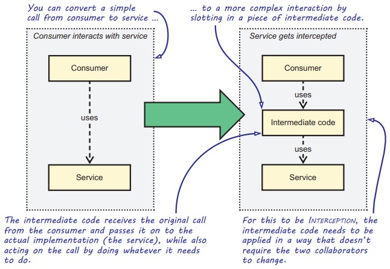
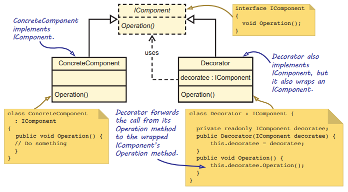
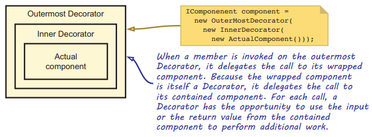
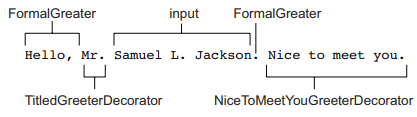
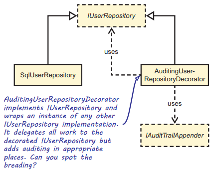

Chapter 9-Interception
==============================

## Decorator design pattern

The concept of ***Interception*** is simple: we want to be able to intercept the call between a consumer and a service, and to execute some code before or after the service is invoked.





A Decorator can wrap another Decorator, which wraps another Decorator, and so on, providing a "pipeline" of interception:



Let's say, for instance, that you have an Abstraction called IGreeter that contains a Greet method:
```C#
public interface IGreeter {
   string Greet(string name);
}
```
For this Abstraction, you can create a simple implementation that creates a formal greeting:
```C#
public class FormalGreeter : IGreeter {
   public string Greet(string name) {
      return "Hello, " + name + ".";
   }
}
```
The simplest Decorator implementation is one that delegates the call to the decorated object without doing anything at all:
```C#
public class SimpleDecorator : IGreeter {   // implements the same abstraction
   private readonly IGreeter decoratee;

   public SimpleDecorator(IGreeter decoratee) {
      this.decoratee = decoratee;
   }

   public string Greet(string name) {   // The call to Greet is passed without any changes to the decorated component
      return this.decoratee.Greet(name);
   }
}
```
more Decorators:
```C#
public class TitledGreeterDecorator : IGreeter {  
   private readonly IGreeter decoratee;

   public SimpleDecorator(IGreeter decoratee) {
      this.decoratee = decoratee;
   }

   public string Greet(string name) {  
      string titledName = "Mr. " + name;
      return this.decoratee.Greet(titledName);
   }
}

public class NiceToMeetYouGreeterDecorator : IGreeter {  
   private readonly IGreeter decoratee;

   public SimpleDecorator(IGreeter decoratee) {
      this.decoratee = decoratee;
   }

   public string Greet(string name) {  
      string greet = this.decoratee.Greet(name);
      return greet + " Nice to meet you.";
   }
}

static void Main(string[] args) {
   IGreeter greeter = new NiceToMeetYouGreeterDecorator(
                          new TitledGreeterDecorator(
                              new FormalGreeter()))
}
```


## Example: Implementing auditing using a Decorator

In this example, we'll implement auditing for the IUserRepository again. As you might recall, we discussed auditing in section 6.3, where we used it as an example when explaining how to fix Dependency cycles. With auditing, you record all of the important actions users make in a system for later analysis.

Auditing is a common example of a Cross-Cutting Concern: it may be required, but the core functionality of reading users shouldn't be affected by auditing. This is exactly what we did in section 6.3. Because we injected the IAuditTrailAppender interface into the SqlUserRepository itself, we forced it to know about and to implement auditing. This is a Single Responsibility Principle violation. The Single Responsibility Principle suggests that we shouldn’t let SqlUserRepository implement auditing; given this, using a Decorator is a better alternative.



```C#
public class AuditingUserRepositoryDecorator : IUserRepository {
   private readonly IAuditTrailAppender appender;
   private readonly IUserRepository decoratee;

   public AuditingUserRepositoryDecorator(IAuditTrailAppender appender, IUserRepository decoratee) {
      this.appender = appender;
      this.decoratee = decoratee;
   }

   public User GetById(Guid id) {
      return this.decoratee.GetById(id);
   }

   public void Update(User user) {
      this.decoratee.Update(user);
      this.appender.Append(user);   // <-- Write operation decorated with auditing
   }
}
```

## Creating a Circuit Breaker for IProductRepository

-To work in the future with Polly

## Reporting exceptions using the Decorator pattern

You can use Interception to add error handling. You don't want to burden a Dependency with error handling. Because a Dependency should be viewed as a reusable component that can be consumed in many different scenarios, it wouldn’t be possible to add an exception-handling strategy to the Dependency that would fit all scenarios. It would also be a violation of the Single Responsibility Principle if you did. e.g. You can add a new `ErrorHandlingProductRepositoryDecorator` class that decorates the `IProductRepository` interface:
```C#
public class ErrorHandlingProductRepositoryDecorator : IProductRepository {
   private readonly IProductRepository decoratee;

   public ErrorHandlingProductRepositoryDecorator(IProductRepository decoratee) {
      this.decoratee = decoratee;
   }

   public void Insert(Product product) {
      try {
         this.decoratee.Insert(product);
      }
      catch (CommunicationException ex) {
         this.AlertUser(ex.Message);
      }
      catch (InvalidOperationException ex) {
         this.AlertUser(ex.Message);
      }
   }
   ...
}
```

## Preventing unauthorized access to sensitive functionality using a Decorator

A common approach to implementing authorization logic is to employ role-based security by checking the user's role(s):
```C#
public class SecureProductRepositoryDecorator : IProductRepository {
   private readonly IUserContext userContext;
   private readonly IProductRepository decoratee;

   public SecureProductRepositoryDecorator(IUserContext userContext, IProductRepository decoratee) {
      this.userContext = userContext;
      this.decoratee = decoratee;
   }

   public IEnumerable<Product> GetAll() {
      return this.decoratee.GetAll();
   }

   public void Delete(Guid id) {
      this.CheckAuthorization();
      this.decoratee.Delete(id);
   }

   private void CheckAuthorization() {
      if (!this.userContext.IsInRole(Role.Administrator)) {
         throw new SecurityException("Access denied.");
      }
   }
   ...
}
```

<!-- <div class="alert alert-info p-1" role="alert">
    
</div> -->

<!--  -->

<!-- <code>&lt;T&gt;</code> -->

<!-- <div class="alert alert-info pt-2 pb-0" role="alert">
    <ul class="pl-1">
      <li></li>
      <li></li>
    </ul>  
</div> -->

<!-- <ul>
  <li><b></b></li>
  <li><b></b></li>
  <li><b></b></li>
  <li><b></b></li>
</ul>  -->

<!-- <span style="color:red">hurt</span> -->

<style type="text/css">
.markdown-body {
  max-width: 1800px;
  margin-left: auto;
  margin-right: auto;
}
</style>

<link rel="stylesheet" href="./zCSS/bootstrap.min.css">
<script src="./zCSS/jquery-3.3.1.slim.min.js"></script>
<script src="./zCSS/popper.min.js"></script>
<script src="./zCSS/bootstrap.min.js"></script>