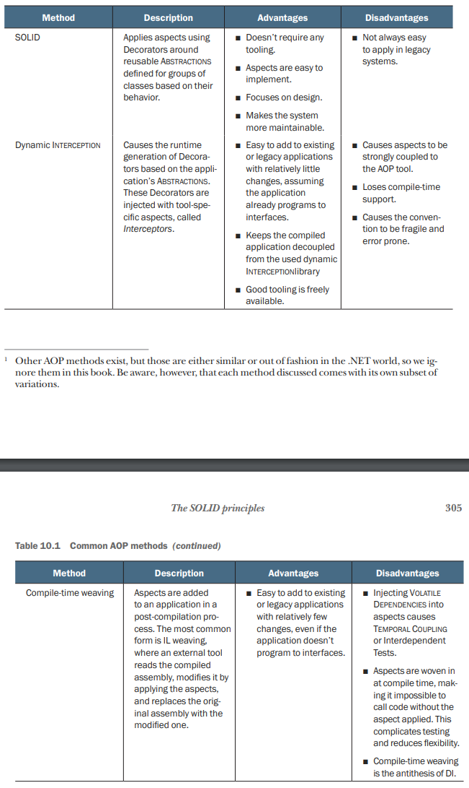
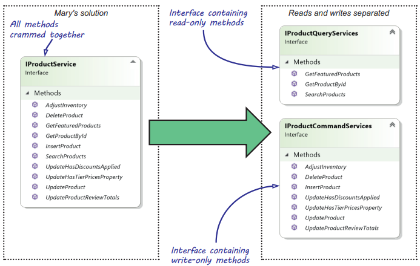
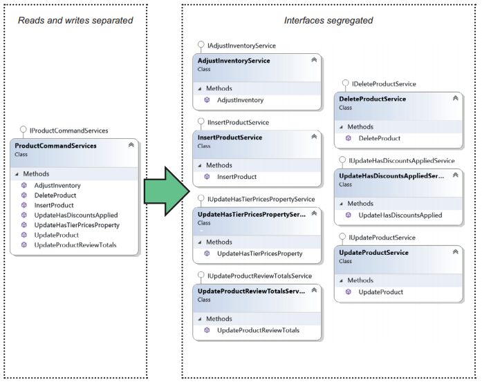
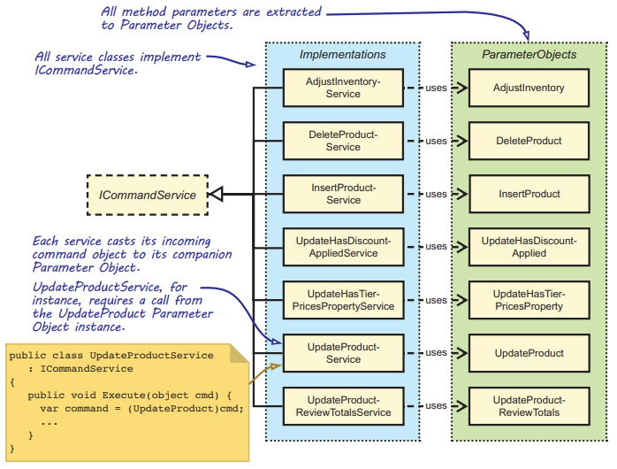
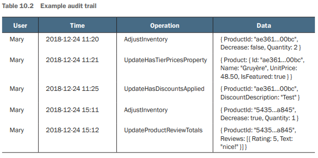

Chapter 10-Aspect Oriented Programming
==============================

AOP  aims to reduce boilerplate code required for implementing cross-cutting concerns and other coding patterns. It does this by implementing such patterns in a single place and applying them to a code base either declaratively or based on conention, without modifying the code itself. AOP as a paradigm focuses on working around the problem of repetition.

For example, let.s look at the following code repetition:
```C#
public void Delete(Product product) {
   this.breaker.Guard();
   try {
      this.decoratee.Delete(product);
      this.breaker.Succeed();
   }
   catch (Exception ex) {
      this.breaker.Trip(ex);
      throw;
   }
}
...
// only two minor difference
public void Insert(Product product) {   // method name is different
   this.breaker.Guard();
   try {
      this.decoratee.Insert(product);   // this line is different
      this.breaker.Succeed();
   }
   catch (Exception ex) {
      this.breaker.Trip(ex);
      throw;
   }
}
```

Common AOP methods are:



## Example: Implementing product-related features using IProductService

Let's dive right in by looking at the IProductService Abstraction that you built in chapter 3 as part of the sample e-commerce application’s domain layer. The following listing shows this interface as originally defined:
```C#
public interface IProductService {
   IEnumerable<DiscountedProduct> GetFeaturedProducts();
}
```
When looking at an application’s design from the perspective of SOLID principles in general, and the OCP in particular, it’s important to take into consideration how the application has changed over time, and from there predict future changes. With this in mind, you can determine whether the application is closed for modification to the changes that are most likely to happen in the future.

It's important to note that even with a SOLID design, there can come a time where a change becomes sweeping. Being 100% closed for modification is neither possible nor desirable. Besides, conforming to the OCP is expensive. It takes considerable effort to find and design the appropriate Abstractions, although too many Abstractions can have a negative impact on the complexity of the application. Your job is to balance the risks and the costs and come up with a global optimum.

Because you should be looking at how the application evolves, evaluating IProductService at a single point in time isn’t that helpful. Fortunately, Mary has been working on her e-commerce application for some time now, and a number of features have been implemented since we last looked over her shoulder. The next listing shows how Mary has progressed:


```C#
public interface IProductService {
   IEnumerable<DiscountedProduct> GetFeaturedProducts();
   void InsertProduct(Product product);
   void DeleteProduct(Guid productId);
   void UpdateProduct(Product product); 
   Product GetProductById(Guid productId);
   void UpdateProductReviewTotals(Guid productId, ProductReview[] reviews);
   void AdjustInventory(Guid productId, bool decrease, int quantity);
   void UpdateHasTierPricesProperty(Product product);
   void UpdateHasDiscountsApplied(Guid productId, string discountDescription);
   Paged<Product> SearchProducts(int pageIndex, int pageSize, Guid? manufacturerId, string searchText);
}
```

## Analysis of IProductService from the perspective of SOLID

Concerning the five SOLID principles, Mary's design violates three out of five SOLID principles, namely, the ISP, SRP, and OCP.

#### ProductService violates the ISP

It's easy to believe that there'll be no single consumer of IProductService that'll use all its methods. Most consumers would typically use one method or a few at most. But how is this violation a problem?

A part of the code base where wide interfaces directly cause trouble is during testing. HomeController’s unit tests, for instance, will define an IProductService Test Double implementation, but such a Test Double is required to implement all its members, even though HomeController itself only uses one method. Even if you could create a reusable Test Double, you typically still want to assert that unrelated methods of IProductService aren't called by HomeController. The following listing shows a Mock IProductService implementation that asserts unexpected methods aren't called.


```C#
public abstract class MockProductService : IProductService {
   public virtual void DeleteProduct(Guid productId) {
      Assert.True(false, "Should not be called.");  // Calling Assert.True with a false argument is confusing, but xUnit lacks a convenient Assert.Fail method.
   }

   public virtual Product GetProductById(Guid id) {
      Assert.True(false, "Should not be called.");
      return null;
   }

   public virtual void InsertProduct(Product product) {
      Assert.True(false, "Should not be called.");
   }

   ... // List of methods goes on. You'll need to implement all 10 methods.
}
```

#### IProductService violates the SRP

Because the ISP is the conceptual underpinning of the SRP, an ISP violation typically indicates an SRP violation in its implementations, as is the case here. SRP violations can sometimes be hard to detect, and you might argue that a ProductService implementation has one responsibility, namely, handling product-related use cases.

The concept of product-related use cases, however, is extremely vague and broad. Rather, you want classes that have only one reason to change. `ProductService` (implementation of `IProductService`) definitely has multiple reasons to change. For instance, any of the following reasons causes `ProductService` to change:

<ul>
  <li>Changes to how discounts are applied</li>
  <li>Changes to how inventory adjustments are processed</li>
  <li>Adding search criteria for products</li>
  <li>Adding a new product-related feature</li>
</ul> 

#### IProductService violates the OCP

You can expect two quite likely changes to happen during the course of the lifetime of the e-commerce application. First, new features will need to be added (Mary already has them on her backlog). Second, Mary likely also needs to apply Cross-Cutting Concerns. With these expected changes, the obvious answer to the question is, "Yes, the current design does cause sweeping changes." Sweeping changes happen both when adding new features and when adding new aspects.

When a new product-related feature is added, the change ripples through all IProductService implementations, which will be the main ProductService implementation, and also all Decorators and Test Doubles. When a new Cross-Cutting Concern is added, there'll likely be rippling changes to the system too, because, besides adding a new Decorator for IProductService, you'll also be adding Decorators for ICustomerService, IOrderService, and all other I...Service Abstractions.

## Improving design by applying SOLID principles

In this section, we'll improve the application’s design step by step by doing the following:

<ul>
  <li>Separate the reads from the writes</li>
  <li>Fix the ISP and SRP violations by splitting interfaces and implementations</li>
  <li>Fix the OCP violation by introducing Parameter Objects and a common interface for implementations</li>
  <li>Fix the accidentally introduced LSP violation by defining a generic Abstraction</li>
</ul> 

#### Step 1: Separating Reads from Write

One of the problems with Mary's current design is that the majority of aspects applied to IProductService are only required by a subset of its methods. Although an aspect such as security typically applies to all features, aspects such as auditing, validation, and fault tolerance will usually only be required around the parts of the application that change state.  An aspect such as caching, on the other hand, may only make sense for methods that read data without changing state. You can simplify the creation of Decorators by splitting IProductService into a read-only and write-only interface, as shown below:



We use the term ***query*** for operations that only read state but don't change the state of the system, and ***command*** for operations that change the state of the system but don't produce any results. This terminology stems from the ***Command-Query Separation (CQS)*** principle. Mary already applied CQS
with IProductService on the method level (void return values for queries, non-void for commands), but by splitting the interface, she now propagates CQS to the interface level.

The advantage of this split is that the new interfaces are finer-grained than before. This reduces the risk of you having to depend on methods that you don't need. When you create a Decorator that applies a transaction to the executed code, for instance, only `IProductCommandServices` will need to be decorated, which eliminates the need to implement the IProductQueryServices's methods. It also makes the implementations smaller and simpler to reason about.

Although this split is an improvement over the original IProductService interface, this new design still causes sweeping changes. As before, implementing a new product-related feature causes a change to many classes in the application. Although you reduced the likelihood of a class being changed by half, a change still causes about the same amount of classes to be touched. This brings us to the second step.

#### Step 2: Fixing ISP and SRP by splitting interfaces and implementations

Because splitting the wide interface pushes us in the right direction, let's take this a step further. We'll focus our attention on IProductCommandServices and ignore IProductQueryServices.

Let's try something radical here. Let's break up IProductCommandServices into multiple one-membered interfaces:



```C#
// The big interface IProductCommandServices segregated into one-membered interfaces
public interface IAdjustInventoryService {
   void AdjustInventory(Guid productId, bool decrease, int quantity);
}

public interface IUpdateProductReviewTotalsService {
   void UpdateProductReviewTotals(Guid productId, ProductReview[] reviews);
}

public interface IUpdateHasDiscountsAppliedService {
   void UpdateHasDiscountsApplied(Guid productId, string description);
}
...
```
This might scare the living daylights out of you, but it might not be as bad as it seems. Here are some compelling advantages to this change:
<ul>
  <li>Every interface is segregated. No client will be forced to depend on methods it doesn't use.</li>
  <li>When you create a one-to-one mapping from interface to implementation, each use case in the application gets its own class. This makes classes small and focused-they have a single responsobility.</li>
  <li>Adding a new feature means the addition of a new interface-implementation pair. No changes have to be made to existing classes that implement other use case.</li>
</ul> 

Even though this new design conforms to the ISP and the SRP, it still violate OCP because of sweeping changes when it comes to creating Decorators. Here's how:
<ul>
  <li>With the IProductCommandServices interface split into seven, one-membered interfaces, there'll be seven Decorator implementations per aspect. With 10 aspects for instance, this means 70 Decorators.</li>
  <li>Making changes to an existing aspect causes sweeping changes throught a large set of classes, because each aspect is spread out over many Decorators.</li>
</ul> 

#### Step 3: Fixing OCP using Parameter Object

Original Version:
```C#
public interface IAdjustInventoryService {
   void AdjustInventory(Guid productId, bool decrease, int quantity);
}

public interface IUpdateProductReviewTotalsService {
   void UpdateProductReviewTotals(Guid productId, ProductReview[] reviews);
}
...
```
Parameter Object Version:
```C#
public interface IAdjustInventoryService {
   void Execute(AdjustInventory command);
}

public class AdjustInventory {
   public Guid ProductId { get; set; }
   public bool Decrease { get; set; } 
   public int Quantity { get; set; }
}

public class UpdateProductReviewTotals {
   public Guid ProductId { get; set; }
   public ProductReview[] Reviews { get; set; }
}

public interface IUpdateProductReviewTotalsService {
   void Execute(UpdateProductReviewTotals command);
}
```
You can now extract a common interface from this pattern:
```C#
public interface ICommandService<TCommand> {
   void Execute(TCommand command)
}
```
```C#
public class AdjustInventoryService : ICommandService<AdjustInventory> {
   private readonly IInventoryRepository repository;

   public AdjustInventoryService(IInventoryRepository repository) {
      this.repository = repository;
   }

   public void Execute(AdjustInventory command) {
      var productId = command.ProductId;
      ...
   }
}
```



The following listing shows how injecting `ICommandService<TCommand>` into the InventoryController
```C#
public class InventoryController : Controller {
   readonly ICommandService<AdjustInventory> service;

   public InventoryController(ICommandService<AdjustInventory> service) {
      this.service = service;
   }

   public ActionResult AdjustInventory(AdjustInventoryViewModel viewModel) {
      ...
      AdjustInventory command = viewModel.Command;

      this.service.Execute(command);

      return this.RedirectToAction("Index");
   }
}
```

## Applying transaction handling using the generic Abstractio

`ICommandService<TCommand>` still allows the creation of a single Decorator per aspect:
```C#
public class TransactionCommandServiceDecorator<TCommand> : ICommandService<TCommand> {
   private readonly ICommandService<TCommand> decoratee;

   public TransactionCommandServiceDecorator(ICommandService<TCommand> decoratee) {
      this.decoratee = decoratee;
   }

   public void Execute(TCommand command) {
      using (var scope = new TransactionScope()) {
         this.decoratee.Execute(command);

         scope.Complete();
      }
   }
}
```

## Adding more Cross-Cutting Concerns

The examples of Cross-Cutting Concerns we discussed in section 9.2, all focused on applying aspects at the boundary of Reposistories (such as `IProductRepository` decorated by `SecureProductRepositoryDecorator` in Listing 9.7). In this section, however, we shift the focus one level up in the layered architecture, from the data access library's repository to the domain library's `IProductService`.

This shift is deliberate, because you'll find those Repositories aren't the right granular level for applying many Cross-Cutting Concerns effectively. A single business action defined in the domain layer would potentially call multiple Repositories, or call the same Repository multiple times. If you were to apply, for instance, a transaction at the level of the respository, it'd still mean that the business operation could potentially run in dozens of transaction, which would endanger the correctness of the system.

#### Example: Implementing an auditing aspect

Implementing a generic auditing aspect for business operations:
```C#
public class AuditingCommandServiceDecorator<TCommand> : : ICommandService<TCommand> {
   private readonly IUserContext userContext;
   private readonly ITimeProvider timeProvider;
   private readonly CommerceContext context;
   private readonly ICommandService<TCommand> decoratee;

   public AuditingCommandServiceDecorator(IUserContext userContext, ..., ICommandService<TCommand> decoratee) {
      this.userContext = userContext;
      ...
      this.decoratee = decoratee;
   }

   public void Execute(TCommand command) {
      this.decoratee.Execute(command);
      this.AppendToAuditTrail(command);
   }

   private void AppendToAuditTrail(TCommand command) {
      var entry = new AuditEntry {
         UserId = this.userContext.CurrentUser.Id, 
         TimeOfExecution = this.timeProvider.Now,
         Operation = command.GetType().Name,
         Data = Newtonsoft.Json.JsonConvert.SerializeObject(command)
      }

      this.context.AuditEntries.Add(entry);
      this.context.SaveChanges();
   }
}
```
<div class="alert alert-info p-1" role="alert">
    You might ask how to implement a decorator only audit non-read operation just like the decorator in chapter 9. You don't need to because you've already segregated IProductService into read only interface and write only interface.
</div>

When Mary runs the application using the `AuditingCommandServiceDecorator<TCommand>`, the Decorator produces the information in the auditing table:




## Example: Implementing a security aspe

During our discussion about Cross-Cutting Concerns in section 9.2, you implemented a `SecureProductRepositoryDecorator` in listing 9.7. Because that Decorator
was specific to `IProductRepository`, it was clear what role the Decorator should grant access to. In the example, access to the write methods of IProductRepository was restricted to the Administrator role.

With this new generic model, a single Decorator is wrapped around all business operations, not just the product CRUD operations. Some operations also need to be executable by other roles, which makes the hard-coded Administrator role unsuited for this generic model. You can implement such a security check on top of a generic Abstraction in many ways, but one compelling method is through the use of passive attributes. A ***passive attribute*** provides metadata rather than behavior.

When you stick to role-based security as an example of authorization, you can specify a `PermittedRoleAttribute` as:
```C#
public class PermittedRoleAttribute : Attribute {
   public readonly Role Role;

   public PermittedRoleAttribute(Role role) {
      this.Role = role;
   }
}

public enum Role {
   PreferredCustomer,
   Administrator,
   InventoryManager
}
```
You can use this attribute to enrich commands with metadata about which role is allowed to execute an operation:
```C#
[PermittedRole(Role.InventoryManager)]
public class AdjustInventory {
   public Guid ProductId { get; set; }
   public bool Decrease { get; set; }
   public int Quantity { get; set; }
}

[PermittedRole(Role.Administrator)] 
public class UpdateProductReviewTotals {
   public Guid ProductId { get; set; }
   public ProductReview[] Reviews { get; set; }
}
```
decorator that uses this attribute:
```C#
public class SecureCommandServiceDecorator<TCommand> : ICommandService<TCommand> {
   private static readonly Role PermittedRole = GetPermittedRole();

   private readonly IUserContext userContext;
   private readonly ICommandService<TCommand> decoratee;

   public SecureCommandServiceDecorator(IUserContext userContext, ICommandService<TCommand> decoratee) {
      this.decoratee = decoratee;
      this.userContext = userContext;
   }

   public void Execute(TCommand command) {
      this.CheckAuthorization();
      this.decoratee.Execute(command);
   }

   private void CheckAuthorization() {
      if (!this.userContext.IsInRole(PermittedRole)) {
         throw new SecurityException();
      }
   }

   private static Role GetPermittedRole() {
      var attribute = typeof(TCommand).GetCustomAttribute<PermittedRoleAttribute>();
      if (attribute == null)
         throw new InvalidOperationException("[PermittedRole] missing.");
      return attribute.Role;
   }
}
```


<!-- <div class="alert alert-info p-1" role="alert">
    
</div> -->

<!--  -->

<!-- <code>&lt;T&gt;</code> -->

<!-- <div class="alert alert-info pt-2 pb-0" role="alert">
    <ul class="pl-1">
      <li></li>
      <li></li>
    </ul>  
</div> -->

<!-- <ul>
  <li><b></b></li>
  <li><b></b></li>
  <li><b></b></li>
  <li><b></b></li>
</ul>  -->

<!-- <span style="color:red">hurt</span> -->

<style type="text/css">
.markdown-body {
  max-width: 1800px;
  margin-left: auto;
  margin-right: auto;
}
</style>

<link rel="stylesheet" href="./zCSS/bootstrap.min.css">
<script src="./zCSS/jquery-3.3.1.slim.min.js"></script>
<script src="./zCSS/popper.min.js"></script>
<script src="./zCSS/bootstrap.min.js"></script>