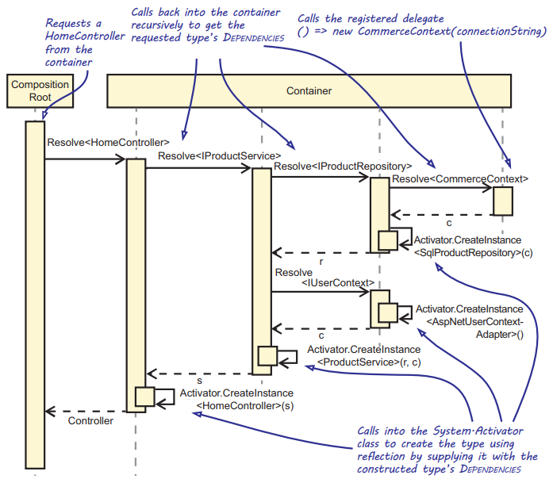
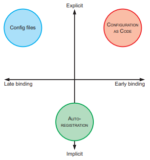
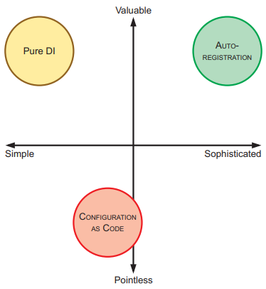

Chapter 12-Introduction to DI Container
==============================

A ***DI Container*** is a software library that can automate many of the tasks involved in Object Composition, Lifetime Management, and Interception.

## Auto-Wiring

***Auto-Wiring*** is the ability to automatically compose an object graph from maps between abstractions and concrete types by making use of reflection.

Below a simplistic DI Container that supports Auto-Wiring, it doesn't support Lifetime Management, Interception, or many other important features. The only supported feature is Auto-Wiring:
```C#
public class AutoWireContainer
{
   Dictionary<Type, Func<object>> registrations = new Dictionary<Type, Func<object>>();

   public void Register(Type serviceType, Type componentType) {
      registrations[serviceType] = () => this.CreateNew(componentType);
   }

   public void Register(Type serviceType, Func<object> factory) {   // let you bypass auto-wiring
      this.registrations[serviceType] = factory;
   }

   public object Resolve(Type type) {
      if (this.registrations.ContainsKey(type)) {
         return this.registrations[type]();
      }
      throw new InvalidOperationException("No registration for " + type);
   }

   private object CreateNew(Type componentType) {   // implements core auto-wiring
      var ctor = componentType.GetConstructors()[0];

      var dependencies = from p in ctor.GetParameters()
                         select this.Resolve(p.ParameterType);

      return Activator.CreateInstance(componentType, dependencies.ToArray());   // dependencies can null empty
   }
}
```
Code below shows how you can use the AutoWireContainer's Register methods to add the required mappings:
```C#
AutoWireContainer container = new AutoWireContainer();

container.Register(typeof(IUserContext), typeof(AspNetUserContextAdapter));

container.Register(typeof(IProductRepository), typeof(SqlProductRepository));

container.Register(typeof(IProductService), typeof(ProductService));

// abstraction and the concrete type are of the same type
container.Register(typeof(HomeController), typeof(HomeController));

// bypass auto-wiring, because you want to supply connectionString manually
container.Register(typeof(CommerceContext), () => new CommerceContext(connectionString));
```
So when you resolve HomeController:
```C#
object controller = container.Resolve(typeof(HomeController));
```
a recursive process starts where the DI Container repeats the process for each argument type until all constructor arguments are satisfied as picture below shows:



## Configuring DI Containers



#### Configuring containers with configuration files

Rare used, to work in the future

#### Configuring containers using Configuration as Code

Below is Configuring Microsoft.Extensions.DependencyInjection with code:
```C#
var services = new ServiceCollection();

services.AddSingleton<IUserContext, AspNetUserContextAdapter>();

services.AddTransient<IProductRepository, SqlProductRepository>();

services.AddTransient<IProductService, ProductService>();

services.AddTransient<HomeController>();

// Overload that allows mapping an Abstraction to a Func<T> delegate, sp is the service provider
services.AddScoped<CommerceContext>(sp => new CommerceContext(connectionString)); 
```

#### Configuring containers by convention using Auto-Registration

The following listing shows how these registrations can start to look somewhat mrepetitive when using Configuration as Code:

```C#
services.AddTransient<IProductRepository, SqlProductRepository>();
services.AddTransient<ICustomerRepository, SqlCustomerRepository>();
services.AddTransient<IOrderRepository, SqlOrderRepository>();
services.AddTransient<IShipmentRepository, SqlShipmentRepository>();
services.AddTransient<IImageRepository, SqlImageRepository>();
services.AddTransient<IProductService, ProductService>();
services.AddTransient<ICustomerService, CustomerService>();
services.AddTransient<IOrderService, OrderService>();
services.AddTransient<IShipmentService, ShipmentService>();
services.AddTransient<IImageService, ImageService>();
...
```
Repeatedly writing registration code like that violates the DRY principle. It also seems like an unproductive piece of infrastructure code that doesn’t add much value to the application. You can save time and make fewer errors if you can automate the registration of components, assuming those components follow some sort of convention. Many DI Containers provide **Auto-Registration** capabilities that let you introduce your own conventions and apply ***Convention over Configuration***.

Convention for scanning repositories using Simple Injector:
```C#
var assembly = typeof(SqlProductRepository).Assembly;

var repositoryTypes = from type in assembly.GetTypes()
                      where !type.Abstract
                      where type.Name.EndsWith("Repository")   // using convention
                      select type;
            
foreach (Type type in repositoryTypes) {
   container.Register(type.GetInterfaces().Single(), type);
}
```
Defining conventions by hand with the use of LINQ might make sense for types all deriving from their own interface, as you’ve seen previously with the repositories. But when you start to register types that are based on a generic interface, this strategy starts to break down rather quickly—querying
generic types through reflection is typically not a pleasant thing to do. Simple Injector allows the registration of all `ICommandService<TCommand>` implementations to be done in a single line of code:
```C#
Assembly assembly = typeof(AdjustInventoryService).Assembly;

container.Register(typeof(ICommandService<>), assembly);
```
Simple injector will probe each type to see which type implement ICommandService and register with concrete types, above code is equivalent to:
```C#
container.Register(typeof(ICommandService<AdjustInventory>), typeof(AdjustInventoryService));
container.Register(typeof(ICommandService<UpdateProductReviewTotals>), typeof(UpdateProductReviewTotalsService));
container.Register(typeof(ICommandService<UpdateHasDiscountsApplied>), typeof(UpdateHasDiscountsAppliedService));
container.Register(typeof(ICommandService<UpdateHasTierPricesProperty>), typeof(UpdateHasTierPricesPropertyService));
```
Another powerful feature of Simple injector is the registration of generic Decorators:
```C#
container.RegisterDecorator(typeof(ICommandService<>), typeof(AuditingCommandServiceDecorator<>));
container.RegisterDecorator(typeof(ICommandService<>), typeof(TransactionCommandServiceDecorator<>));
container.RegisterDecorator(typeof(ICommandService<>), typeof(SecureCommandServiceDecorator<>));
```
is equivalent to:
```C#
container.RegisterDecorator(typeof(ICommandService<AdjustInventory>), typeof(AuditingCommandServiceDecorator<AdjustInventory>));
container.RegisterDecorator(typeof(ICommandService<AdjustInventory>), typeof(TransactionCommandServiceDecorator<AdjustInventory>));
container.RegisterDecorator(typeof(ICommandService<AdjustInventory>), typeof(SecureCommandServiceDecorator<AdjustInventory>));

container.RegisterDecorator(typeof(ICommandService<UpdateProductReviewTotals>), typeof(AuditingCommandServiceDecorator<UpdateProductReviewTotals>));
container.RegisterDecorator(typeof(ICommandService<UpdateProductReviewTotals>), typeof(TransactionCommandServiceDecorator<UpdateProductReviewTotals>));
container.RegisterDecorator(typeof(ICommandService<UpdateProductReviewTotals>), typeof(SecureCommandServiceDecorator<UpdateProductReviewTotals>));
...
```




<!-- <div class="alert alert-info p-1" role="alert">
    
</div> -->

<!--  -->

<!-- <code>&lt;T&gt;</code> -->

<!-- <div class="alert alert-info pt-2 pb-0" role="alert">
    <ul class="pl-1">
      <li></li>
      <li></li>
    </ul>  
</div> -->

<!-- <ul>
  <li><b></b></li>
  <li><b></b></li>
  <li><b></b></li>
  <li><b></b></li>
</ul>  -->

<!-- <span style="color:red">hurt</span> -->

<style type="text/css">
.markdown-body {
  max-width: 1800px;
  margin-left: auto;
  margin-right: auto;
}
</style>

<link rel="stylesheet" href="./zCSS/bootstrap.min.css">
<script src="./zCSS/jquery-3.3.1.slim.min.js"></script>
<script src="./zCSS/popper.min.js"></script>
<script src="./zCSS/bootstrap.min.js"></script>