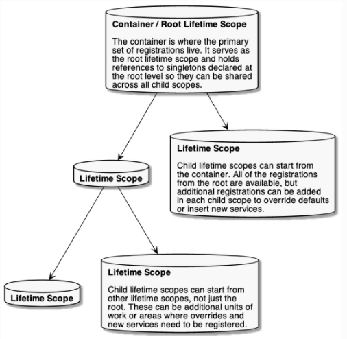
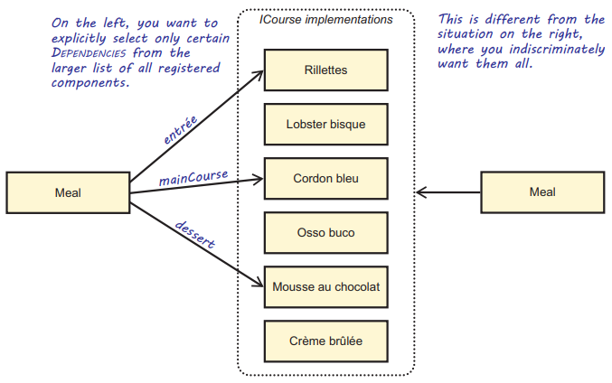
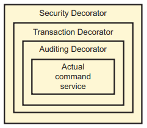

Chapter 13-Autofac
==============================

Source code:
```C#
public interface IContainer : ILifetimeScope, IComponentContext, IDisposable, IAsyncDisposable {
   DiagnosticListener DiagnosticSource { get; }
}

public sealed class ContainerBuilder {
   public ContainerBuilder();

   public IComponentRegistryBuilder ComponentRegistryBuilder { get; }
   public IDictionary<string, object?> Properties { get; }

   public IContainer Build(ContainerBuildOptions options = ContainerBuildOptions.None);
   ...
}

public static partial class RegistrationExtensions {

   public static IRegistrationBuilder<TLimit, TActivatorData, TStyle> InstancePerRequest<TLimit, TActivatorData, TStyle>( this IRegistrationBuilder<TLimit, TActivatorData, TStyle> registration, params object[] lifetimeScopeTags) {
      ...
      var tags = new[] { MatchingScopeLifetimeTags.RequestLifetimeScopeTag }.Concat(lifetimeScopeTags).ToArray();   // now you see what "AutofacWebRequest" is
      return registration.InstancePerMatchingLifetimeScope(tags);
   }
}

public static class MatchingScopeLifetimeTags {
   public static readonly object RequestLifetimeScopeTag = "AutofacWebRequest";
}

// ------------------------------------------------------------------------------------------------------------------------------------------------
public interface IRegistrationBuilder<out TLimit, out TActivatorData, out TRegistrationStyle> {
   ...
   IRegistrationBuilder<TLimit, TActivatorData, TRegistrationStyle> As(params Service[] services);
   IRegistrationBuilder<TLimit, TActivatorData, TRegistrationStyle> As(params Type[] services);

   IRegistrationBuilder<TLimit, TActivatorData, TRegistrationStyle> SingleInstance();
   IRegistrationBuilder<TLimit, TActivatorData, TRegistrationStyle> InstancePerDependency();
   IRegistrationBuilder<TLimit, TActivatorData, TRegistrationStyle> InstancePerLifetimeScope();
   IRegistrationBuilder<TLimit, TActivatorData, TRegistrationStyle> InstancePerMatchingLifetimeScope(params object[] lifetimeScopeTag);
   ...  // note that InstancePerRequest is not in here, I think it is because InstancePerRequest uses InstancePerMatchingLifetimeScope internally
}
internal class RegistrationBuilder<TLimit, TActivatorData, TRegistrationStyle> : IRegistrationBuilder<TLimit, TActivatorData, TRegistrationStyle> {
   
   public RegistrationBuilder(Service defaultService, TActivatorData activatorData, TRegistrationStyle style) {
      ActivatorData = activatorData;
      RegistrationStyle = style;
      RegistrationData = new RegistrationData(defaultService);
      ResolvePipeline = new ResolvePipelineBuilder(PipelineType.Registration);
   }

   public TActivatorData ActivatorData { get; }
   public TRegistrationStyle RegistrationStyle { get; }
   public RegistrationData RegistrationData { get; }
   public IResolvePipelineBuilder ResolvePipeline { get; }

   public IRegistrationBuilder<TLimit, TActivatorData, TRegistrationStyle> InstancePerDependency() {
      RegistrationData.Sharing = InstanceSharing.None;
      RegistrationData.Lifetime = CurrentScopeLifetime.Instance;
      return this;
   }

   public IRegistrationBuilder<TLimit, TActivatorData, TRegistrationStyle> SingleInstance() {
      RegistrationData.Sharing = InstanceSharing.Shared;
      RegistrationData.Lifetime = RootScopeLifetime.Instance;
      return this;
   }

   public IRegistrationBuilder<TLimit, TActivatorData, TRegistrationStyle> InstancePerLifetimeScope() {
      RegistrationData.Sharing = InstanceSharing.Shared;
      RegistrationData.Lifetime = CurrentScopeLifetime.Instance;
      return this;
   }

   public IRegistrationBuilder<TLimit, TActivatorData, TRegistrationStyle> InstancePerMatchingLifetimeScope(params object[] lifetimeScopeTag) {
      if (lifetimeScopeTag == null) {
         throw new ArgumentNullException(nameof(lifetimeScopeTag));
      }

      RegistrationData.Sharing = InstanceSharing.Shared;
      RegistrationData.Lifetime = new MatchingScopeLifetime(lifetimeScopeTag);
      return this;
   }
   ...
   public IRegistrationBuilder<TLimit, TActivatorData, TRegistrationStyle> As<TService>() {
      return As(new TypedService(typeof(TService)));
   }

   public IRegistrationBuilder<TLimit, TActivatorData, TRegistrationStyle> As<TService1, TService2>() {
      return As(new TypedService(typeof(TService1)), new TypedService(typeof(TService2)));
   }

   public IRegistrationBuilder<TLimit, TActivatorData, TRegistrationStyle> As(Type service) {
      return As(new TypedService(service));
   }
   ...
   public IRegistrationBuilder<TLimit, TActivatorData, TRegistrationStyle> As(params Service[] services) {
      RegistrationData.AddServices(services);
      return this;
   }
}

public interface IRegistrationBuilder<out TLimit, out TActivatorData, out TRegistrationStyle> {
   ...
   IRegistrationBuilder<TLimit, TActivatorData, TRegistrationStyle> As<TService>() where TService : notnull;
   IRegistrationBuilder<TLimit, TActivatorData, TRegistrationStyle> As<TService1, TService2>();
   IRegistrationBuilder<TLimit, TActivatorData, TRegistrationStyle> As<TService1, TService2, TService3>();
   IRegistrationBuilder<TLimit, TActivatorData, TRegistrationStyle> As(params Service[] services);
   IRegistrationBuilder<TLimit, TActivatorData, TRegistrationStyle> As(params Type[] services);
   ...
}

public interface ILifetimeScope : IComponentContext, IDisposable, IAsyncDisposable {
   ...
   ILifetimeScope BeginLifetimeScope();
   ...
}

public interface IComponentContext {
   IComponentRegistry ComponentRegistry { get; }
   object ResolveComponent(ResolveRequest request);
}

public static class ResolutionExtensions {
   ...
   public static TService Resolve<TService>(this IComponentContext context) where TService : notnull;
   public static object Resolve(this IComponentContext context, Type serviceType);
   ...
}
```

## Configuring instance scopes

```C#
// AddSingleton MSDI equivalent
builder.RegisterType<SauceBéarnaise>().SingleInstance();

// AddScoped MSDI equivalent
builder.RegisterType<SauceBéarnaise>().InstancePerRequest();
// InstancePerRequest uses InstancePerMatchingLifetimeScope internally, see above source code ,which means InstancePerRequest is the same as:
builder.RegisterType<SauceBéarnaise>().InstancePerMatchingLifetimeScope(MatchingScopeLifetimeTags.RequestLifetimeScopeTag);

// AddTransient MSDI equivalent
builder.RegisterType<SauceBéarnaise>().InstancePerDependency();
// Since InstancePerDependency is the default scope, you can also do:
builder.RegisterType<SauceBéarnaise>();

// no equivalent counterpart to MSDI's AddXXX extension method, MSDI is not that flexible as autofac
builder.RegisterType<SauceBéarnaise>().InstancePerLifetimeScope();

// no equivalent counterpart to MSDI's AddXXX extension method
builder.RegisterType<SauceBéarnaise>().InstancePerMatchingLifetimeScope("some-tag");
```

#### Difference between InstancePerLifetimeScope and InstancePerMatchingLifetimeScope

You might wonder why `InstancePerLifetimeScope()` is not equivalent to MSDI's `AddScoped()`. Let's look at the code below that shows the difference:
```C#
// InstancePerLifetimeScope
var builder = new ContainerBuilder();
builder.RegisterType<Worker>().InstancePerLifetimeScope();

using(var scope1 = container.BeginLifetimeScope())
{
  for(var i = 0; i < 100; i++)
  {
    // Every time you resolve this from within this
    // scope you'll get the same instance.
    var w1 = scope1.Resolve<Worker>();
  }
}

using(var scope2 = container.BeginLifetimeScope())
{
  for(var i = 0; i < 100; i++)
  {
    // Every time you resolve this from within this
    // scope you'll get the same instance, but this
    // instance is DIFFERENT than the one that was
    // used in the above scope. New scope = new instance.
    var w2 = scope2.Resolve<Worker>();
  }
}

using(var scope3 = container.BeginLifetimeScope())
{
  var w3 = scope3.Resolve<Worker>();
  using(var scope4 = scope3.BeginLifetimeScope())
  {
    // w3 and w4 are DIFFERENT because they come from
    // two different scopes.
    var w4 = scope4.Resolve<Worker>();
  }
}

// The CONTAINER is a lifetime scope! If you resolve an
// InstancePerLifetimeScope service from the container,
// that instance will live for the duration of the container
// and will effectively be a singleton. It will be held
// for the lifetime of the container in case something else
// tries to resolve a Worker from the container.
var w5 = container.Resolve<Worker>();
using(var scope5 = container.BeginLifetimeScope())
{
  // w5 and w6 are DIFFERENT.
  var w6 = scope5.Resolve<Worker>();
}
```
Now let's look into `InstancePerMatchingLifetimeScope`
```C#
// InstancePerMatchingLifetimeScope
var builder = new ContainerBuilder();
builder.RegisterType<Worker>().InstancePerMatchingLifetimeScope("my-request");

// Create the lifetime scope using the tag.
using(var scope1 = container.BeginLifetimeScope("my-request"))
{
  for(var i = 0; i < 100; i++)
  {
    var w1 = scope1.Resolve<Worker>();
    using(var scope2 = scope1.BeginLifetimeScope())
    {
      var w2 = scope2.Resolve<Worker>();

      // w1 and w2 are always the same object
      // instance because the component is per-matching-lifetime-scope,
      // so it's effectively a singleton within the
      // named scope.
    }
  }
}

// Create another lifetime scope using the tag.
using(var scope3 = container.BeginLifetimeScope("my-request"))
{
  for(var i = 0; i < 100; i++)
  {
    // w3 will be DIFFERENT than the worker resolved in the
    // earlier tagged lifetime scope.
    var w3 = scope3.Resolve<Worker>();
    using(var scope4 = scope3.BeginLifetimeScope())
    {
      var w4 = scope4.Resolve<Worker>();

      // w3 and w4 are always the same object because
      // they're in the same tagged scope, but they are
      // NOT the same as the earlier workers (w1, w2).
    }
  }
}

// You can't resolve a per-matching-lifetime-scope component
// if there's no matching scope.
using(var noTagScope = container.BeginLifetimeScope())
{
  // This throws an exception because this scope doesn't
  // have the expected tag and neither does any parent scope!
  var fail = noTagScope.Resolve<Worker>();
}
```
Now you should see the difference, Instance Per Matching Lifetime Scope let you declare "singleton" services that can be shared in its nested child scope.

#### Simplest possible use of Autofac:
```C#
var builder = new ContainerBuilder();     // ContainerBuilder is equivalent to MSDI's ServiceCollection

builder.RegisterType<SauceBearnaise>();   // default lifetime is transitent

IContainer container = builder.Build();   // this is the root container, which is also root lifetime scope; container is equivalent to MSDI's ServiceProvider

var sauce = container.Resolve<SauceBearnaise>();   // resolve service from root lifetime scope

ILifetimeScope scope = container.BeginLifetimeScope();   // create a child lifetime scope

SauceBearnaise sauce1 = scope.Resolve<SauceBearnaise>();   // resolve service from child lifetime scope
```

I guess Autodac will do the following code, once InstancePerRequest component is registered and autofac knows a HTTP request occurs in asp.net core:
```C#
using(var scope1 = container.BeginLifetimeScope(MatchingScopeLifetimeTags.RequestLifetimeScopeTag)) { 
   ...
}
```

## Configuring the ContainerBuilder using Configuration as Code

All configurations in Autofac use the API exposed by the ContainerBuilder class, although most of the methods you use are extension methods. One of the most commonly used methods is the RegisterType method:
```C#
builder.RegisterType<SauceBearnaise>().As<IIngredient>();
```

but this make you can only resolve from `IIngredient`, if you want to resolve by itself, you do:
```C#
builder.RegisterType<SauceBearnaise>().As<SauceBearnaise, IIngredient>();
```
which is the same as:
```C#
builder.RegisterType<SauceBearnaise>().As<SauceBearnaise>().As<IIngredient>();
```

But be careful of ***Torn Lifestyle***:
```C#
// style 1
builder.RegisterType<SauceBearnaise>().As<SauceBearnaise>().As<IIngredient>();

// style 2
builder.RegisterType<SauceBearnaise>();
builder.RegisterType<SauceBearnaise>().As<IIngredient>();
```
you might think both style 1 and style 2 are the same, but it is not! This becomes apparent when you change the Lifestyle from Transient to, for instance, Singleton:
```C#
builder.RegisterType<SauceBearnaise>().SingleInstance();
builder.RegisterType<SauceBearnaise>().As<IIngredient>().SingleInstance();
```
Although you might expect there to only be one SauceBearnaise instance for the lifetime of the container, splitting up the registration causes Autofac to create a separate instance per RegisterType call, which means the resolved service you get via `container.Resolve<SauceBearnaise>()` is different than the one you get via `container.Resolve<IIngredient>()` because Autofac creates two SauceBearnaise instances. The Lifestyle of SauceBearnaise is therefore considered to be torn.

## Configuring the ContainerBuilder using Auto-Registration

To get the Assembly instance, you can use a representative class (in this case, Steak):
```C#
Assembly ingredientsAssembly = typeof(Steak).Assembly;

// register all types in the assembly as IIngredient, which is not what you want
builder.RegisterAssemblyTypes(ingredientsAssembly).As<IIngredient>();

// use a predicate to define a selection criteria 
builder.RegisterAssemblyTypes(ingredientsAssembly).Where(typeof(IIngredient).IsAssignableFrom(type)).Where(type => type.Name.StartsWith("Sauce")).As<IIngredient>();
```

To register against base classes instead of interfaces:
```C#
// As methodtakes a Func<Type, Type>
builder.RegisterAssemblyTypes(policiesAssembly).Where(type => type.Name.EndsWith("Policy")).As(type => type.BaseType);
```

## Auto-Registration of generic Abstractions using AsClosedTypesOf

The AdjustInventoryService from chapter 10:
```C#
public interface ICommandService<TCommand> {
   void Execute(TCommand command);
}

public class AdjustInventoryService : ICommandService<AdjustInventory>
{
   private readonly IInventoryRepository repository;

   public AdjustInventoryService(IInventoryRepository repository)
      this.repository = repository;
   }

   public void Execute(AdjustInventory command) {
      var productId = command.ProductId;
      ...
   }
}
```
Auto-Registration of `ICommandService<TCommand>` implementations:
```C#
Assembly assembly = typeof(AdjustInventoryService).Assembly;

builder.RegisterAssemblyTypes(assembly).AsClosedTypesOf(typeof(ICommandService<>));
```
Behind the scenes, Autofac interates through the list of assembly types and registers all types that implement a closed-generic version of `ICommandService<TCommand>`. For example, Autofac will register `AdjustInventoryService` as `ICommandService<AdjustInventory>`

## Controlling Scope and Lifetime



A lifetime scope defines a derived container that you can use for a particular duration or purpose; the most obvious example is a web request. You spawn a scope from a container so that the scope inherits all the Singleton tracked by the parent container, but the scope also acts as a container of local Singletons. When a lifetime-scoped component is requested from a lifetime scope, you always receive the same instance. The difference from true Singletons is that if you query a second scope, you’ll get another instance.

One of the important features of lifetime scopes is that they allow you to properly release components when the scope completes. You create a new scope with the BeginLifetimeScope method and release all appropriate components by invoking its Dispose method like so:
```C#
using (var scope = container.BeginLifetimeScope()) {   // Creates a scope from the root container
   IMeal meal = scope.Resolve<IMeal>();   // Resolves a meal from the newly created scope
   meal.Consume();
}   // Autofac disposed the meal (IMeal implements IDispose) by calling IMeal.Dispose() method when the scope itself is disposed
```

Dependencies of a component are always resolved at or below (the top is "below") the component's lifetime scope. For example, if you need a Transient Dependency injected into a Singleton, that Transient Dependency comes from the root container even if you're resolving the Singleton from a nested lifetime scope. This will track the Transient within the root container and prevent it from being disposed of when the lifetime scope gets disposed of. The Singleton consumer would otherwise break, because it's kept alive in the root container while depending on a component that was disposed of. Let's look at a concrete example:
```C#
// code below throws DependencyResolutionException
var builder = new ContainerBuilder();
builder.RegisterType<Dog>().As<IDog>().SingleInstance();

IContainer container = builder.Build();

using (var childScope1 = container.BeginLifetimeScope(b => { b.RegisterType<Owner>().As<IOwner>().InstancePerDependency(); })) {
   IDog dog = childScope1.Resolve<IDog>();
}

public interface IOwner { }

public interface IDog { }

public class Owner : IOwner { }

public class Dog : IDog {
   IOwner owner;
   public Dog(IOwner owner) {
      this.owner = owner;
   }
}
```
it throws the exception because even it is the childScope1 that tried to resolve `IDog`, but `IDog` is registered as Singleton, because Autofac treats Singleton registrations special, **so the root container will actually resolve `IDog`**, causing the dependencies (`IOwner`) of `IDog` also needs to be resolved in root container lifetime scope, which means you need to register `IOwner` in root container, it doesn't matter if you have already register `IOwner` in  childScope1. Since there is no registration in the root container, the exception is thrown.

But if we change the code as:
```C#
// runs OK
var builder = new ContainerBuilder();
builder.RegisterType<Dog>().As<IDog>().SingleInstance();
builder.RegisterType<Owner>().As<IOwner>().InstancePerDependency();   // new registration in root lifetime scope

IContainer container = builder.Build();

using (var childScope1 = container.BeginLifetimeScope(b => { b.RegisterType<Owner>().As<IOwner>().InstancePerDependency(); })) {
   IDog dog = childScope1.Resolve<IDog>();
}
```
or we can do:
```C#
// runs OK
var builder = new ContainerBuilder();
builder.RegisterType<Dog>().As<IDog>().InstancePerDependency();

IContainer container = builder.Build();

using (var childScope1 = container.BeginLifetimeScope(b => { b.RegisterType<Owner>().As<IOwner>().InstancePerDependency(); })) {
   IDog dog = childScope1.Resolve<IDog>();
}
```

<div class="alert alert-info p-1" role="alert">
    Do not resolve disposable Transient component in the root container, it will causes memory leaks because Autofac tracks disposable components, so these transient instances will be kept alive and only be disposed when the root container is disposed of, which is when the application stops. See the example below. Note that it's OK to resolve non-disposable Transient component in the root container
</div>

Tracking containers like Autofac hold references to the **disposable** components they create. This means that the container will hold a reference to it even when it is no longer being used by the rest of the program, the garbage collector will be unable to reclaim the memory held by that component if you don't dispose the lifetime scope. Note that Autofac won't hold the references to non disposable components they create. The following program will eventually exhaust all available memory and crash:
```C#
interface IMyResource { … }

class MyResource : IMyResource, IDisposable { … }

var builder = new ContainerBuilder();
builder.RegisterType<MyResource>().As<IMyResource>();
using (var container = builder.Build()) {
    while (true)
        var r = container.Resolve<IMyResource>(); // Out of memory!
}
```

## Registering difficult APIs

#### Configuring primitive Dependencies:
```C#
public enum Spiciness { Mild, Medium, Hot }

public class ChiliConCarne : ICourse {
   public ChiliConCarne(Spiciness spiciness) {
      ...
   }
}
```
If you want all consumers of Spiciness to use the same value, you can register Spiciness and ChiliConCarne independently of each other. This snippet shows how:
```C#
builder.Register<Spiciness>(c => Spiciness.Medium); // see Registering objects with code blocks section
builder.RegisterType<ChiliConCarne>().As<ICourse>();

// use WithParameter method, "spiciness" is the parameter name, kind of weird 
builder.RegisterType<ChiliConCarne>().As<ICourse>().WithParameter("spiciness", Spiciness.Hot);
```

#### Configuring using RegisterInstance

```C#
var builder = new ContainerBuilder();

MyClass myClass = new MyClass();
builder.RegisterInstance<MyClass>(myClass);   // RegisterInstance can only be Singleton

// code below compiles but throws System.InvalidOperationException : The instance registration 'MyClass' can support SingleInstance() sharing only.
builder.RegisterInstance<MyClass>(myClass).InstancePerDependency();
```

#### Registering objects with code blocks
```C#
builder.Register(c => new A(c.Resolve<B>()));   // Autofac will infer the return type, so it is like whenever A is request, the code block executes one/many time depends on lifetime
```
Another use case is sometimes a type's constructor is private or internal, Autofac only looks after public constructors, you can only construct and provide an instance from a factory:
```C#
public class JunkFood : IMeal {
   internal JunkFood(string name) {
      ...
   }
}

public static class JunkFoodFactory {
   public static JunkFood Create(string name) {
      return new JunkFood(name);
   }
}

builder.Register<IMeal>(c => JunkFoodFactory.Create("chicken meal"));
```
The Register method is type-safe, but it disables Auto-Wiring.

## Working with multiple components

```C#
var builder = new ContainerBuilder();
builder.RegisterType<Steak>().As<IIngredient>();
builder.RegisterType<SauceBéarnaise>().As<IIngredient>();   // this last registration wins if you resolve IIngredient
builder.RegisterType<ChiliConCarne>().As<IIngredient>().PreserveExistingDefaults();  // SauceBéarnaise still wins becvause of PreserveExistingDefaults
```
you can use `IEnumerable<T>` to indicate that you want all services of a given type:
```C#
IEnumerable<IIngredient> ingredients = scope.Resolve<IEnumerable<IIngredient>>();
```

When you register components, you can give each registration a name that you can later use to select among the different components:
```C#
builder.RegisterType<Steak>().Named<IIngredient>("meat");
builder.RegisterType<SauceBéarnaise>().Named<IIngredient>("sauce")
...
IIngredient meat = scope.ResolveNamed<IIngredient>("meat");
IIngredient sauce = scope.ResolveNamed<IIngredient>("sauce");
```
A named component doesn’t count as a default component. If you only register named components, you can't resolve a default instance of the service.
But nothing prevents you from also registering a default (unnamed) component with the As method. You can even do it in the same statement by method chaining.

Autofac also lets you identify components with arbitrary keys:
```C#
object meatKey = new object();
builder.RegisterType<Steak>().Keyed<IIngredient>(meatKey);
...
IIngredient meat = scope.ResolveKeyed<IIngredient>(meatKey);
```

## Registering named Dependencie
```C#
public class ThreeCourseMeal : IMeal {
   public ThreeCourseMeal(ICourse entrée, ICourse mainCourse, ICourse dessert) {
      ...
   }
}
...
builder.RegisterType<Rillettes>().Named<ICourse>("entrée");
builder.RegisterType<CordonBleu>().Named<ICourse>("mainCourse");
builder.RegisterType<MousseAuChocolat>().Named<ICourse>("dessert");

builder.RegisterType<ThreeCourseMeal>().As<IMeal>()
   .WithParameter(   // Parameter in WithParameter means constructor parameter of ThreeCourseMeal
      (p, c) => p.Name == "entree",                    // Func<ParameterInfo, IComponentContext, bool> predicate
      (p, c) => c.ResolveNamed<ICourse>("entree"))     // Func<ParameterInfo, IComponentContext, object> valueAccessor);
   .WithParameter(
      (p, c) => p.Name == "mainCourse",
      (p, c) => c.ResolveNamed<ICourse>("mainCourse"))
   .WithParameter(
      (p, c) => p.Name == "dessert",
      (p, c) => c.ResolveNamed<ICourse>("dessert"));
```
The predicate parameter is a test that determines whether the valueAccessor delegate will be invoked. When predicate returns true, valueAccessor is invoked to provide the value for the parameter.

You can also resolve named components by convention (parameter names have to be the same as named registration, but this is not refactoring-safe):
```C#
builder.RegisterType<ThreeCourseMeal>().As<IMeal>()
   .WithParameter(
      (p, c) => true,
      (p, c) => c.ResolveNamed(p.Name, p.ParameterType));
```

## Picking only some components from a larger set

The need to inject a subset of a complete collection isn't a common scenario, but it does demonstrate how to solve more-complex needs that you might encounter.



```C#
builder.RegisterType<Meal>().As<IMeal>().WithParameter(
   (p, c) => true,        //  Meal class has only a single constructor parameter, so this'll work.
   (p, c) => new[] {
      c.ResolveNamed<ICourse>("entrée"),
      c.ResolveNamed<ICourse>("mainCourse"),
      c.ResolveNamed<ICourse>("dessert")
   });
```

## Wiring Decorators

#### Decorating non-generic Abstractions with RegisterDecorator

```C#
builder.RegisterType<VealCutlet>().As<IIngredient>();

builder.RegisterDecorator<HamCheeseGarlic, IIngredient>();

builder.RegisterDecorator<Breading, IIngredient>();

// The  object graph equal to
new Breading(
   new HamCheeseGarlic(
      new VealCutlet()
   )    
)
```

#### Decorating generic Abstractions with RegisterGenericDecorator

```C#
builder.RegisterAssemblyTypes(assembly).AsClosedTypesOf(typeof(ICommandService<>));

builder.RegisterGenericDecorator(typeof(AuditingCommandServiceDecorator<>), typeof(ICommandService<>));

builder.RegisterGenericDecorator(typeof(TransactionCommandServiceDecorator<>), typeof(ICommandService<>));

builder.RegisterGenericDecorator(typeof(SecureCommandServiceDecorator<>), typeof(ICommandService<>));
```


## Wiring Composites

#### Wiring non-generic Composite

Let's take a look at how you can register Composites like the CompositeNotificationService from chapter 6 in Autofac. The following listing shows this class again:
```C#
public class CompositeNotificationService : INotificationService {  
   private readonly IEnumerable<INotificationService> services;

   public CompositeNotificationService(IEnumerable<INotificationService> services) {   
      this.services = services;
   }

   public void OrderApproved(Order order) {
      foreach (var service in this.services) {
         service.OrderApproved(order);   
      }
   }
} 
```
Registering a Composite requires that it be added as a **default registration** while injecting it with a sequence of named instances:
```C#
builder.RegisterType<OrderApprovedReceiptSender>().Named<INotificationService>("service");

builder.RegisterType<AccountingNotifier>().Named<INotificationService>("service");

builder.RegisterType<OrderFulfillment>().Named<INotificationService>("service");

// default registration
builder.Register(c => new CompositeNotificationService(c.ResolveNamed<IEnumerable<INotificationService>>("service"))).As<INotificationService>();
```

Because the number of notification services will likely grow over time, you can reduce the burden on your Composition Root by applying Auto-Registration:
```C#
builder.RegisterAssemblyTypes(assembly).Named<INotificationService>("service");   // assembly only contain types that implements INotificationService

builder.Register(c => new CompositeNotificationService(c.ResolveNamed<IEnumerable<INotificationService>>("service"))).As<INotificationService>();
```
But Autofac might throw the exception: Circular component dependency detected

An elegant way to fix is using the Except method:
```C#
builder.RegisterAssemblyTypes(assembly).Except<CompositeNotificationService>().Named<INotificationService>("service");   
```

Composite classes, however, aren't the only classes that might require removal. You'll have to do the same for any Decorator:
```C#
builder.RegisterAssemblyTypes(assembly)
   .Except<CompositeNotificationService>()
   .Where(type => !IsDecoratorFor<INotificationService>(type))
   .Named<INotificationService>("service");

private static bool IsDecoratorFor<T>(Type type) {
   // A type is considered to be a Decorator when it both implements the given T Abstraction and its constructor also requires a T.
   return typeof(T).IsAssignableFrom(type) && type.GetConstructors()[0].GetParameters().Any(p => p.ParameterType == typeof(T));
}
```

## Wiring generic Composites

```C#
public interface IEventHandler<TEvent> {    
   void Handle(TEvent e);
}

public class CompositeEventHandler<TEvent> : IEventHandler<TEvent> {
   private readonly IEnumerable<IEventHandler<TEvent>> handlers;

   public CompositeEventHandler(IEnumerable<IEventHandler<TEvent>> handlers) {
      this.handlers = handlers;
   }

   public void Handle(TEvent e) {
      foreach (var handler in this.handlers) {
         handler.Handle(e);
      }
   }
}
```
-To work in the future, can't really understand how `select new KeyedService("handler", interfaceType))` work internally.

<!-- <div class="alert alert-info p-1" role="alert">
    
</div> -->

<!--  -->

<!-- <code>&lt;T&gt;</code> -->

<!-- <div class="alert alert-info pt-2 pb-0" role="alert">
    <ul class="pl-1">
      <li></li>
      <li></li>
    </ul>  
</div> -->

<!-- <ul>
  <li><b></b></li>
  <li><b></b></li>
  <li><b></b></li>
  <li><b></b></li>
</ul>  -->

<!-- <span style="color:red">hurt</span> -->

<style type="text/css">
.markdown-body {
  max-width: 1800px;
  margin-left: auto;
  margin-right: auto;
}
</style>

<link rel="stylesheet" href="./zCSS/bootstrap.min.css">
<script src="./zCSS/jquery-3.3.1.slim.min.js"></script>
<script src="./zCSS/popper.min.js"></script>
<script src="./zCSS/bootstrap.min.js"></script>