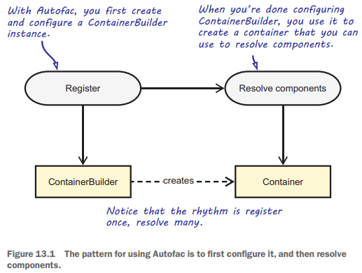
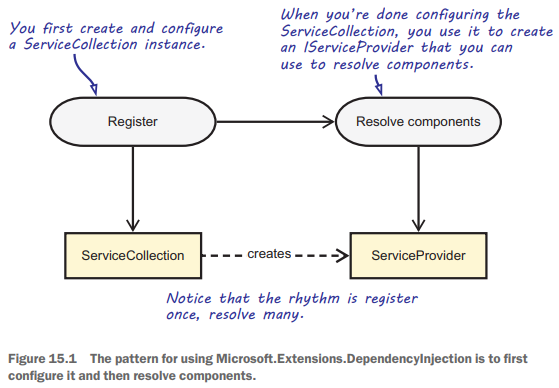
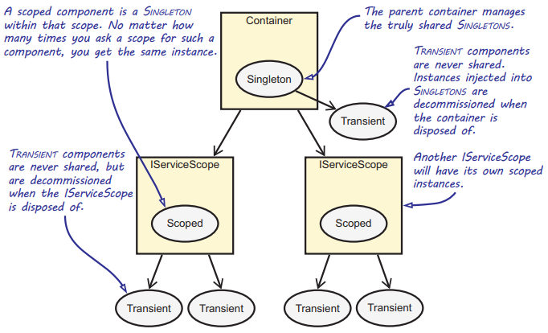

Chapter 15-The Microsoft.Extensions.DependencyInjection DI Container
==============================

Source Code:
```C#
//  Describes a service with its service type, implementation, and lifetime.
public class ServiceDescriptor {
   
   public ServiceDescriptor(Type serviceType, Type implementationType, ServiceLifetime lifetime) : this(serviceType, lifetime) { 
      ImplementationType = implementationType;
   }

   public ServiceDescriptor(Type serviceType, object instance) : this(serviceType, ServiceLifetime.Singleton) {
      ImplementationInstance = instance;
   }

   public ServiceDescriptor(Type serviceType, Func<IServiceProvider, object> factory, ServiceLifetime lifetime) : this(serviceType, lifetime) {
      ImplementationFactory = factory;
   }

   private ServiceDescriptor(Type serviceType, ServiceLifetime lifetime) {
      Lifetime = lifetime;
      ServiceType = serviceType;
   }

   public ServiceLifetime Lifetime { get; }
   public Type ServiceType { get; }
   public Type ImplementationType { get; }
   public object ImplementationInstance { get; }
   public Func<IServiceProvider, object> ImplementationFactory { get; }

   internal Type GetImplementationType() {
      if (ImplementationType != null) {
         return ImplementationType;
      } else if (ImplementationInstance != null) {
         return ImplementationInstance.GetType();
      } else if (ImplementationFactory != null) {
         var typeArguments = ImplementationFactory.GetType().GenericTypeArguments;
         return typeArguments[1];
      }
      return null;
   }

   // Creates an instance of ServiceDescriptor with the specified TService, TImplementation and ServiceLifetime.Transient lifetime
   public static ServiceDescriptor Transient<TService, TImplementation>() where TService : class where TImplementation : class, TService {
      return Describe<TService, TImplementation>(ServiceLifetime.Transient);
   }

   public static ServiceDescriptor Transient(Type service, Type implementationType) {
      return Describe(service, implementationType, ServiceLifetime.Transient);
   }

   public static ServiceDescriptor Transient(Type service, Func<IServiceProvider, object> implementationFactory) {
      return Describe(service, implementationFactory, ServiceLifetime.Transient);
   }
   ...
   public static ServiceDescriptor Describe(Type serviceType, Type implementationType, ServiceLifetime lifetime) {
      return new ServiceDescriptor(serviceType, implementationType, lifetime);
   }
}

//--------------------------------------------------------------------------------------------------------------------------------------------

public interface IServiceCollection : IList<ServiceDescriptor>, ICollection<ServiceDescriptor>, IEnumerable<ServiceDescriptor>, IEnumerable { 
  
}

public class ServiceCollection : IServiceCollection {
   private readonly List<ServiceDescriptor> _descriptors = new List<ServiceDescriptor>();
   public int Count => _descriptors.Count;
   public bool IsReadOnly => false;
   public ServiceDescriptor this[int index] {
      get {
         return _descriptors[index];
      }
      set {
         _descriptors[index] = value;
      }
   }
   ...
   void ICollection<ServiceDescriptor>.Add(ServiceDescriptor item) {
       _descriptors.Add(item);
   }
}

public static class ServiceCollectionServiceExtensions
{
   ...
   // Note that all AddXXX are extension methods from ServiceCollectionServiceExtensions
   
   public static IServiceCollection AddSingleton<TService>(this IServiceCollection services, TService implementationInstance) where TService : class { 
      return services.AddSingleton(typeof(TService), implementationInstance);
   }

   public static IServiceCollection AddSingleton(this IServiceCollection services, Type serviceType, object implementationInstance) {
      var serviceDescriptor = new ServiceDescriptor(serviceType, implementationInstance);
      services.Add(serviceDescriptor);
      return services;
   }

   public static IServiceCollection AddTransient<TService, TImplementation>(this IServiceCollection services)
      where TService : class
      where TImplementation : class, TService {
      if (services == null) {
         throw new ArgumentNullException(nameof(services));
      }

      return services.AddTransient(typeof(TService), typeof(TImplementation));
   }

   public static IServiceCollection AddTransient(this IServiceCollection services, Type serviceType, Type implementationType) {
      return Add(services, serviceType, implementationType, ServiceLifetime.Transient);
   }

   public static IServiceCollection AddTransient<TService>(this IServiceCollection services, Func<IServiceProvider, TService> implementationFactory) {  
      return services.AddTransient(typeof(TService), implementationFactory);
   }

   private static IServiceCollection Add(IServiceCollection collection, Type serviceType, Type implementationType, ServiceLifetime lifetime) {
      var descriptor = new ServiceDescriptor(serviceType, implementationType, lifetime);
      collection.Add(descriptor);
      return collection;
   }
}

//------------------------------------------------------------------------------------------------------------------------------

public static class ServiceCollectionContainerBuilderExtensions {
   public static ServiceProvider BuildServiceProvider(this IServiceCollection services) {
      return BuildServiceProvider(services, ServiceProviderOptions.Default);
   }

   public static ServiceProvider BuildServiceProvider(this IServiceCollection services, bool validateScopes) {
      return services.BuildServiceProvider(new ServiceProviderOptions { ValidateScopes = validateScopes });
   }

   public static ServiceProvider BuildServiceProvider(this IServiceCollection services, ServiceProviderOptions options) {
      return new ServiceProvider(services, options);
   }
}

public static class ServiceProviderServiceExtensions {
   // return null if there is no such service
   public static T GetService<T>(this IServiceProvider provider) {
      return (T)provider.GetService(typeof(T));
   }
   
   public static T GetRequiredService<T>(this IServiceProvider provider) {
      return (T)provider.GetRequiredService(typeof(T));
   }
   
   public static object GetRequiredService(this IServiceProvider provider, Type serviceType) {
      ...
      var service = provider.GetService(serviceType);
      if (service == null) {
        throw new InvalidOperationException(...);
      }

      return service;
   }

   public static IServiceScope CreateScope(this IServiceProvider provider) {
      return provider.GetRequiredService<IServiceScopeFactory>().CreateScope();   // try to find IServiceScopeFactory from ServiceProvider(I think it is 
                                                                                  // the ServiceProviderEngine), but don't know why not just access it 
                                                                                  // directly? this code is too advance, don't worry about it for now
   }
}

public interface IServiceProvider {
   object GetService(Type serviceType);
}

public interface IServiceScope : IDisposable {
   IServiceProvider ServiceProvider { get; }
}

public interface IServiceScopeFactory {
   IServiceScope CreateScope();
}

public sealed class ServiceProvider : IServiceProvider, IDisposable, IServiceProviderEngineCallback {
   private readonly IServiceProviderEngine _engine;
   private readonly CallSiteValidator _callSiteValidator;
   
   internal ServiceProvider(IEnumerable<ServiceDescriptor> serviceDescriptors, ServiceProviderOptions options) {   // serviceDescriptors is actually ServiceCollection
      IServiceProviderEngineCallback callback = null;
      if (options.ValidateScopes) {
         callback = this;   // pass itself to ServiceProviderEngine
         _callSiteValidator = new CallSiteValidator();
      }
      switch (options.Mode) {   // note that a ServiceProviderEngine contains the root scope internally via its Root setter property
         case ServiceProviderMode.Dynamic:
            _engine = new DynamicServiceProviderEngine(serviceDescriptors, callback);
            break;
         case ServiceProviderMode.Runtime:
            _engine = new RuntimeServiceProviderEngine(serviceDescriptors, callback);
            break;
         case ServiceProviderMode.ILEmit:
            _engine = new ILEmitServiceProviderEngine(serviceDescriptors, callback);
            break;
         case ServiceProviderMode.Expressions:
            _engine = new ExpressionsServiceProviderEngine(serviceDescriptors, callback);
            break;
         default:
            throw new NotSupportedException(nameof(options.Mode));
      }
   }

   public object GetService(Type serviceType) => _engine.GetService(serviceType);   // ServiceProviderEngine is the one that actually resolves services
                                                                                    // Those services are resolved from root container (pass only one argument)

   public void Dispose() => _engine.Dispose();

   void IServiceProviderEngineCallback.OnCreate(ServiceCallSite callSite) {
       _callSiteValidator.ValidateCallSite(callSite);
   }

   void IServiceProviderEngineCallback.OnResolve(Type serviceType, IServiceScope scope) {
       _callSiteValidator.ValidateResolution(serviceType, scope, _engine.RootScope);
   }
}

internal abstract class ServiceProviderEngine : IServiceProviderEngine, IServiceScopeFactory {  // note that ServiceProviderEngine can create a new scope
   private readonly IServiceProviderEngineCallback _callback;
   private readonly Func<Type, Func<ServiceProviderEngineScope, object>> _createServiceAccessor;
   private bool _disposed;

   protected ServiceProviderEngine(IEnumerable<ServiceDescriptor> serviceDescriptors, IServiceProviderEngineCallback callback) {  // callback is actually ServiceProvider
      _createServiceAccessor = CreateServiceAccessor;
      _callback = callback;
      Root = new ServiceProviderEngineScope(this);   // root scope, represented by a new ServiceProviderEngineScope instance with ServiceProviderEngine instance
      RuntimeResolver = new CallSiteRuntimeResolver();
      CallSiteFactory = new CallSiteFactory(serviceDescriptors);
      CallSiteFactory.Add(typeof(IServiceProvider), new ServiceProviderCallSite());
      CallSiteFactory.Add(typeof(IServiceScopeFactory), new ServiceScopeFactoryCallSite());  // I think this is related to the ServiceProviderServiceExtensions.CreateScope method
      RealizedServices = new ConcurrentDictionary<Type, Func<ServiceProviderEngineScope, object>>();
   }

   internal ConcurrentDictionary<Type, Func<ServiceProviderEngineScope, object>> RealizedServices { get; }  // use ConcurrentDictionary multithreading purose I think

   internal CallSiteFactory CallSiteFactory { get; }
   protected CallSiteRuntimeResolver RuntimeResolver { get; }
   public ServiceProviderEngineScope Root { get; }
   public IServiceScope RootScope => Root;
   public object GetService(Type serviceType) => GetService(serviceType, Root);   // get service from root scope

   internal object GetService(Type serviceType, ServiceProviderEngineScope serviceProviderEngineScope) {   // get service from scope
      if (_disposed)
         ThrowHelper.ThrowObjectDisposedException();
      var realizedService = RealizedServices.GetOrAdd(serviceType, _createServiceAccessor);
      _callback?.OnResolve(serviceType, serviceProviderEngineScope);
      return realizedService.Invoke(serviceProviderEngineScope);
   }

   protected abstract Func<ServiceProviderEngineScope, object> RealizeService(ServiceCallSite callSite);

   public void Dispose() {
      _disposed = true;
      Root.Dispose();
   }

   public IServiceScope CreateScope() {
      if (_disposed) 
         ThrowHelper.ThrowObjectDisposedException();
      
      return new ServiceProviderEngineScope(this);   // note that same engine is attached to new scope everytime a new scope is created, there is always one engine.
   }
   
   private Func<ServiceProviderEngineScope, object> CreateServiceAccessor(Type serviceType) {
      var callSite = CallSiteFactory.GetCallSite(serviceType, new CallSiteChain());
      if (callSite != null) {
         _callback?.OnCreate(callSite);
         return RealizeService(callSite);
      }
      return _ => null;
   }
}

/*
public interface IServiceProvider {
   object GetService(Type serviceType);
}

public interface IServiceScope : IDisposable {
   IServiceProvider ServiceProvider { get; }
}
*/
internal class ServiceProviderEngineScope : IServiceScope, IServiceProvider {   // ServiceProviderEngineScope is also ServiceProvider
   // For testing only
   internal Action<object> _captureDisposableCallback;
   private List<IDisposable> _disposables;
   private bool _disposed;

   public ServiceProviderEngineScope(ServiceProviderEngine engine) {   // ehgine is always the engie when the first ServiceProvider is created
      Engine = engine;
   }

   internal Dictionary<ServiceCacheKey, object> ResolvedServices { get; } = new Dictionary<ServiceCacheKey, object>();

   public ServiceProviderEngine Engine { get; }

   public object GetService(Type serviceType) {
      if (_disposed)
         ThrowHelper.ThrowObjectDisposedException();
      return Engine.GetService(serviceType, this);   // engine finds the service in a specified scope
   }

   public IServiceProvider ServiceProvider => this;  // it returns itself so it can be used as: scope.ServiceProvider.GetRequiredService<SauceBéarnaise>();
                                                     // but why adds extra step? why we need to call `scope.ServiceProvider.GetServices<IIngredient>();`? 
                                                     // why not just `scope.GetServices<IIngredient>()`?
                                                     

   public void Dispose() {
      lock (ResolvedServices) {
         if (_disposed) {
            return;  
         }
         _disposed = true;
         if (_disposables != null) {
            for (var i = _disposables.Count - 1; i >= 0; i--) {
               var disposable = _disposables[i];
               disposable.Dispose();
            }
            _disposables.Clear();
         }
         ResolvedServices.Clear();
      }
   }

   internal object CaptureDisposable(object service) {
      _captureDisposableCallback?.Invoke(service);

      if (!ReferenceEquals(this, service)) {
         if (service is IDisposable disposable) {
            lock (ResolvedServices) {
               if (_disposables == null) {
                  _disposables = new List<IDisposable>();
               }
               _disposables.Add(disposable);
            }
         }
      }
      return service;
   }
}
```

<div class="alert alert-info pt-2 pb-0" role="alert">
   If you want to know the difference between GetService method and GetRequiredService (recommended to use) method, check this article: https://andrewlock.net/the-difference-between-getservice-and-getrquiredservice-in-asp-net-core/
</div>

## Introducing Microsoft.Extensions.DependencyInjection

Autofac two-step process:



MS.DI this two-step process:





MS.DI's ServiceCollection is the equivalent of Autofac's ContainerBuilder

## Resolving objects

```C#
var services = new ServiceCollection();    // 1

services.AddTransient<SauceBéarnaise>();   // 2

ServiceProvider container = services.BuildServiceProvider(validateScopes: true);   // 3, root container (ServiceProvider) is also root scope

IServiceScope scope = container.CreateScope();   // 4, CreateScope is an extension method from ServiceProviderServiceExtensions

SauceBéarnaise sauce = scope.ServiceProvider.GetRequiredService<SauceBéarnaise>();   // 5, scope.ServiceProvider is actually scope itself
```

Combined with the source code, the process is:

1. new up an instance of `ServiceCollection` which contains a list of `List<ServiceDescriptor>` internally.

2. register service type on the `ServiceCollection` instance via `ServiceCollectionServiceExtensions.AddTransient<TService>` method. Mote that `ServiceCollectionServiceExtensions` contains generic `AddTransient<TService>(this IServiceCollection services)` and non-generic `AddTransient(this IServiceCollection services, Type serviceType)`, generic methods actually call non-generic methods by adding `typeof(T)`, so using generic method save you some keystrokes by using `typeof(T)` for you. The methods in `ServiceCollectionServiceExtensions` eventually adds a new `ServiceDescriptor` to `ServiceCollection` via `ServiceCollectionServiceExtensions`'s `Add(IServiceCollection collection, Type serviceType, Type implementationType, ServiceLifetime lifetime)` method.

3. Create a `ServiceProvider` instance via `ServiceCollectionContainerBuilderExtensions.BuildServiceProvider` method:
```C#
public static class ServiceCollectionContainerBuilderExtensions {
   ...
   public static ServiceProvider BuildServiceProvider(this IServiceCollection services, ServiceProviderOptions options) {
      return new ServiceProvider(services, options);
   }
}
```
 `ServiceProvider` contains `IServiceProviderEngine` internally, this engine is actually the one that resolve services.

4. Create a new scope (`ServiceProviderEngineScope`) from `ServiceProvider`. The sequence is:  ServiceProviderServiceExtensions's `CreateScope` method is called, then somehow the `ServiceProvider` instance's engine instance (`ServiceProviderEngine`) is accessed (via `provider.GetRequiredService<IServiceScopeFactory>()`, don't know why not just access the engine directly via property, but it is advance code, must be some other reason, don't worry about it now). Then the ServiceProviderEngine's `CreateScope()` method is called (`IServiceScopeFactory` interface contains `CreateScope()` method, and `ServiceProviderEngineScope` implements `IServiceScopeFactory`). Note that `ServiceProviderEngine` create a new `ServiceProviderEngineScope` and pass itself as the argument

5. Get the service from `ServiceProviderEngineScope`'s `ServiceProvider` property, note that the source code is `public IServiceProvider ServiceProvider => this;`, so `ServiceProviderEngineScope` acts as a ServiceProvider, because `ServiceProviderEngineScope` implements `IServiceProvider` too, so you can get requried service from it. Now you should see that it is the `ServiceProviderEngineScope` (acts as a ServiceProvider) that resolve the service you request by calling `Engine.GetService(serviceType, this)`, you see `this` is a `ServiceProviderEngineScope` itself, now you see how MSDI resolve service in different scope,  **that is how and why you should resolve service via a scope (not from root scope unless it is a singleton service)**

Note that the whole process only involve a singe `ServiceProviderEngine`, which is created when the first `ServiceProvider` instance is created:
```C#
public static class ServiceCollectionContainerBuilderExtensions {
   ...
   public static ServiceProvider BuildServiceProvider(this IServiceCollection services, ServiceProviderOptions options) {
      return new ServiceProvider(services, options);
   }
}

public sealed class ServiceProvider : IServiceProvider, IDisposable, IServiceProviderEngineCallback {
   private readonly IServiceProviderEngine _engine;
   ...
   switch (options.Mode) {
      case ServiceProviderMode.Dynamic:
         _engine = new DynamicServiceProviderEngine(serviceDescriptors, callback);
         break;
         ...
   }
   ...
}
```

In a nutshell, you should get services from scope, not from root container which is also a ServiceProvider.

A side note below shows the difference on how root container (first `ServiceProvider`) resovle a service from root container itself and how `ServiceProviderEngineScope` resolve a service in a specficed scope:
```C#
public sealed class ServiceProvider : IServiceProvider, IDisposable {
   private readonly IServiceProviderEngine _engine;
   ...
   public object GetService(Type serviceType) => _engine.GetService(serviceType);   // called GetService(serviceType, Root) internally, that's why you always get a                                                                                // serivce root scope if you reslove service from root container
}

internal class ServiceProviderEngineScope : IServiceScope, IServiceProvider {
   ...
   public object GetService(Type serviceType) {
      return Engine.GetService(serviceType, this);  
   }
}

internal abstract class ServiceProviderEngine : IServiceProviderEngine, IServiceScopeFactory {
   protected ServiceProviderEngine(IEnumerable<ServiceDescriptor> serviceDescriptors, IServiceProviderEngineCallback callback) {
      ...
      Root = new ServiceProviderEngineScope(this);
      ...
   }

   public object GetService(Type serviceType) => GetService(serviceType, Root);

   internal object GetService(Type serviceType, ServiceProviderEngineScope serviceProviderEngineScope) {   // you provide a specific scope
      ...
   }
}
```

As a safety measure, always build the ServiceProvider using the BuildServiceProvider overload with the validateScopes argument set to true.

When validateScopes is set to true, the default service provider performs checks to verify that:

<ul>
  <li>Scoped services aren't directly or indirectly resolved from the root service provider.</li>
  <li>Scoped services aren't directly or indirectly injected into singletons.</li>
</ul> 

Note that it doesn't check if Transient services injected into singletons or resoved from the root container because transient services are supposed to live together with its consumers.

With the introduction of ASP.NET Core 2.0, validateScopes is automatically set to true by the framework when the application is running in the development environment, but it's best to enable validation even outside the development environment as well. This means you’ll have to call BuildServiceProvider(true) manually.

## Mapping Abstractions to concrete type

```C#
var services = new ServiceCollection();

services.AddTransient<IIngredient, SauceBéarnaise>();

var container = services.BuildServiceProvider(true);

IServiceScope scope = container.CreateScope();

IIngredient sauce = scope.ServiceProvider.GetRequiredService<IIngredient>();
```

## Configuring the ServiceCollection using Configuration as Code

```C#
services.AddTransient<SauceBéarnaise>();
services.AddTransient<IIngredient>(sp => sp.GetRequiredService<SauceBéarnaise>());   // sp is the correct ServiceProviderEngineScope to be used in the future
```
You might think why we can't do:

```C#
services.AddTransient<SauceBéarnaise>();
services.AddTransient<IIngredient, SauceBéarnaise>();
```
Again, it will cause **torn lifestyles**. This becomes apparent when you change the Lifestyle from Transient to, for instance, Singleton:
```C#
services.AddSingleton<SauceBéarnaise>();
services.AddSingleton<IIngredient, SauceBéarnaise>();
```
Although you might expect there to only be one SauceBéarnaise instance for the lifetime of the container, splitting up the registration causes MS.DI to create a separate instance per AddSingleton call. The Lifestyle of SauceBéarnaise is therefore considered to be torn.

<div class="alert alert-info p-1" role="alert">
    Each call to one of the AddScoped and AddSingleton methods results in its own unique cache. Having multiple Add... calls can, therefore, result in multiple instances per scope or per container. To prevent this, register a delegate that resolves the concrete instance.
</div>

## Configuring ServiceCollection using Auto-Registration

```C#
Assembly ingredientsAssembly = typeof(Steak).Assembly;

// register with interface
var ingredientTypes =
   from type in ingredientsAssembly.GetTypes()
   where !type.IsAbstract
   where typeof(IIngredient).IsAssignableFrom(type)
   where type.Name.StartsWith("Sauce")  
   select type;

foreach (var type in ingredientTypes) {
   services.AddTransient(typeof(IIngredient), type);
}

Assembly policiesAssembly = typeof(DiscountPolicy).Assembly;

// register with abstract classes
var policyTypes =
   from type in policiesAssembly.GetTypes()
   where type.Name.EndsWith("Policy")
   select type;

foreach (var type in policyTypes) {
   services.AddTransient(type.BaseType, type);
}
```

## Auto-Registration of generic Abstractions

The AdjustInventoryService from chapter 10:
```C#
public interface ICommandService<TCommand> {
   void Execute(TCommand command);
}

public class AdjustInventoryService : ICommandService<AdjustInventory>
{
   private readonly IInventoryRepository repository;

   public AdjustInventoryService(IInventoryRepository repository)
      this.repository = repository;
   }

   public void Execute(AdjustInventory command) {
      var productId = command.ProductId;
      ...
   }
}
```
Auto-Registration of `ICommandService<TCommand>` implementations:
```C#
Assembly assembly = typeof(AdjustInventoryService).Assembly;

var mappings =
   from type in assembly.GetTypes()
   where !type.IsAbstract
   where !type.IsGenericType
   from i in type.GetInterfaces()   // i is ICommandService<AdjustInventory>
   where i.IsGenericType
   where i.GetGenericTypeDefinition() == typeof(ICommandService<>)
   select new { service = i, type };

foreach (var mapping in mappings) {
   services.AddTransient(mapping.service, mapping.type);
}
```

## Registering objects with code blocks

Another option for creating a component with a primitive value is to use one of the Add... methods, which let you supply a delegate that creates the component:
```C#
services.AddTransient<ICourse>(sp => new ChiliConCarne(Spiciness.Hot));   // sp is ServiceProvider
```

Another use case is sometimes a type's constructor is private or internal, Autofac only looks after public constructors, you can only construct and provide an instance from a factory:
```C#
public class JunkFood : IMeal {
   internal JunkFood(string name) {
      ...
   }
}

public static class JunkFoodFactory {
   public static JunkFood Create(string name) {
      return new JunkFood(name);
   }
}

services.AddTransient<IMeal>(sp => JunkFoodFactory.Create("chicken meal"));
```

## Selecting among multiple candidates

As you already know that you can register multiple implementations of the same interface:
```C#
services.AddTransient<IIngredient, SauceBéarnaise>();
services.AddTransient<IIngredient, Steak>();
```
You can also ask the container to resolve all IIngredient components. MS.DI has adedicated method to do that, called GetServices:
```C#
IEnumerable<IIngredient> ingredients = scope.ServiceProvider.GetServices<IIngredient>();
// or
IEnumerable<IIngredient> ingredients = scope.ServiceProvider.GetRequiredService<IEnumerable<IIngredient>>();
```
Notice that you use the normal GetRequiredService method, but that you request `IEnumerable<IIngredient>`. The container interprets this as a convention and gives you all the IIngredient components it has.

## Removing ambiguity using code blocks

As useful as Auto-Wiring is, sometimes you need to override the normal behavior to provide fine-grained control over which Dependencies go where, but it may also be that you need to address an ambiguous API. As an example, consider this constructor:
```C#
public ThreeCourseMeal(ICourse entrée, ICourse mainCourse, ICourse dessert)
```
In this case, you have three identically typed Dependencies, each of which represents a different concept. In most cases, you want to map each of the Dependencies to aseparate type.

As stated previously, when compared to Autofac, MS.DI is limited in functionality. Where Autofac provides keyed registrations, MS.DI falls short in this respect. There isn’t any built-in functionality to do this. To wire up such an ambiguous API with MS.DI, you have to revert to using a code block:
```C#
services.AddTransient<IMeal>(sp => new ThreeCourseMeal(
   entrée: sp.GetRequiredService<Rillettes>(),
   mainCourse: sp.GetRequiredService<CordonBleu>(),
   dessert: sp.GetRequiredService<CrèmeBrûlée>()));
```
MS.DI contains a utility class called `ActivatorUtilities` (that use System.Reflection.ConstructorInfo's Invoke instance method internally) that allows Auto-Wiring a class's Dependencies:
```C#
public static class ActivatorUtilities {
   ...
   public static T CreateInstance<T>(IServiceProvider provider, params object[] parameters);
}

services.AddTransient<IMeal>(c => ActivatorUtilities.CreateInstance<ThreeCourseMeal>(
   sp,
   new object[] {
      sp.GetRequiredService<Rillettes>(),
      sp.GetRequiredService<CordonBleu>(),
      sp.GetRequiredService<MousseAuChocolat>()
   }));
```

## Wiring non-generic Composit

Let's take a look at how you can register Composites, such as the CompositeNotificationService of chapter 6 in MS.DI. The following listing shows this class:
```C#
public class CompositeNotificationService : INotificationService {
   private readonly IEnumerable<INotificationService> services;

   public CompositeNotificationService(IEnumerable<INotificationService> services) {
      this.services = services;
   }

   public void OrderApproved(Order order) {
      foreach (INotificationService service in this.services) {
         service.OrderApproved(order);
      }
   }
}
```
Registering a Composite requires it to be added as a default registration, while injecting it with a sequence of resolved instances:
```C#
services.AddTransient<OrderApprovedReceiptSender>();
services.AddTransient<AccountingNotifier>();
services.AddTransient<OrderFulfillment>();

services.AddTransient<INotificationService>(sp =>
   new CompositeNotificationService(
      new INotificationService[] {
         sp.GetRequiredService<OrderApprovedReceiptSender>(),
         sp.GetRequiredService<AccountingNotifier>(),
         sp.GetRequiredService<OrderFulfillment>(),
      }));
```


<!--  -->

<!-- <code>&lt;T&gt;</code> -->

<!-- <div class="alert alert-info pt-2 pb-0" role="alert">
    <ul class="pl-1">
      <li></li>
      <li></li>
    </ul>  
</div> -->

<!-- <ul>
  <li><b></b></li>
  <li><b></b></li>
  <li><b></b></li>
  <li><b></b></li>
</ul>  -->

<!-- <span style="color:red">hurt</span> -->

<style type="text/css">
.markdown-body {
  max-width: 1800px;
  margin-left: auto;
  margin-right: auto;
}
</style>

<link rel="stylesheet" href="./zCSS/bootstrap.min.css">
<script src="./zCSS/jquery-3.3.1.slim.min.js"></script>
<script src="./zCSS/popper.min.js"></script>
<script src="./zCSS/bootstrap.min.js"></script>